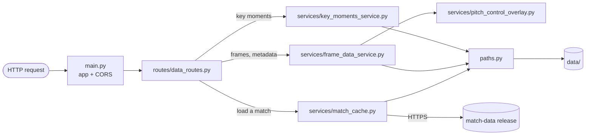
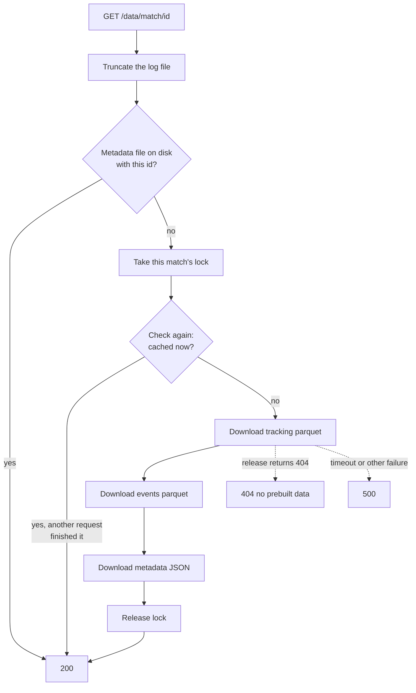

# Backend flow

This page follows each request through the backend, from the route that
receives it to the bytes that go back. For the request and response shapes on
their own, see the [API reference](../reference/api.md). For where the backend
sits in the whole system, see the [system overview](./system-overview.md).

## The layers

The backend is small enough to hold in your head: one router, three services,
and one module that knows file names.



| File | Responsibility |
|---|---|
| `backend/main.py` | Creates the FastAPI app, adds CORS, mounts the router. |
| `backend/config.py` | Reads `.env` and environment variables: allowed origins, data URL, port. |
| `backend/routes/data_routes.py` | The four data endpoints, the "is this match loaded" gate, error-to-status mapping. |
| `backend/services/match_cache.py` | Decides whether a match is cached, downloads it if not, holds the per-match locks. |
| `backend/services/frame_data_service.py` | Reads the cached files and builds the per-frame response. Also serves metadata. |
| `backend/services/key_moments_service.py` | Derives phases of play, shots and goals from the event file. |
| `backend/services/pitch_control_overlay.py` | A thin wrapper over databallpy's single-frame pitch control. |
| `backend/paths.py` | The only place that knows what the three files for a match are called. |
| `backend/logger.py` | One logger writing to the console and to `logs/playtactix.log`. |

`paths.py` exists so that the code that writes a match's files and the code
that reads them cannot disagree on a file name. Every service asks it for
`meta_data_path(id)`, `tracking_data_path(id)` or `events_data_path(id)`.

`data_ingestor_github.py` also lives in `services/`, but the server never
imports it. It is the build-time parser, covered in the
[data pipeline](./data-pipeline.md).

## Startup

`main.py` imports `config` before anything else, on purpose: that import loads
`.env`, and other modules read environment variables when they are imported.
The app then gets CORS middleware restricted to `ALLOWED_ORIGINS` (the Vite
dev server by default) and the data router under the `/data` prefix.

Nothing is loaded at startup. No match is downloaded and no file is read
until a request asks for one.

## The gate: a match must be loaded first

Three of the four endpoints share a FastAPI dependency, `require_loaded_match`.
It runs before the route body and calls `is_match_cached(match_id)`, which
opens `meta_data_{id}.json` and checks the id inside it matches. If the file
is missing or unreadable, the request ends there:

```
409 Conflict
{"detail": "Match 1886347 is not loaded. Call GET /data/match/1886347 first."}
```

Why refuse, rather than have these endpoints download a missing match
themselves? Because downloading is the one slow, risky operation in the
backend. It takes seconds, it can fail (no published data, a timeout), and it
needs locks so that two requests do not download the same match at once. If
every endpoint could start a download, every endpoint would need that failure
handling and that locking.

Instead, only `GET /data/match/{id}` downloads. The other three endpoints
just read files, and the gate guarantees those files exist before their code
runs. The cost is that a client must load a match before asking anything else
about it, and the 409 message tells it exactly that.

Why the metadata file alone proves the whole set is there is explained in
[match cache](../concepts/match-cache.md).

## Request 1: load a match

`GET /data/match/{match_id}` is the only endpoint that writes anything.



Step by step:

1. **The route is a plain `def`, not `async def`.** FastAPI runs plain
   functions on a threadpool thread. The download blocks for as long as the
   transfer takes, and on a thread that does not stop the server answering
   other requests. See
   [locks and concurrency](../concepts/locks-and-concurrency.md).
2. **Fast path.** If the match is already cached, return straight away. No
   lock is taken, so repeat loads of a cached match never queue.
3. **Lock, then check again.** Otherwise take the lock for this match id and
   re-check. If a concurrent request downloaded the match while this one was
   waiting, there is nothing left to do.
4. **Download three files, metadata last.** Each one is streamed in 1 MB
   chunks to a `.tmp` file and renamed into place, so memory use stays flat
   and no reader ever sees part of a file. See
   [atomic writes](../concepts/atomic-writes.md). The download has a 10 second
   connect timeout and a 60 second read timeout, so a stalled transfer fails
   instead of holding a thread forever.
5. **Map the outcome to a status.** A `404` from the release means nobody
   built this match, and becomes a `404` here. Anything else that goes wrong
   becomes a `500`.

If a download fails partway, whatever finished stays on disk, but the
metadata file is not there, so the match still counts as not cached and the
next request starts the download again.

## Request 2: match metadata

`GET /data/match_meta?match_id=` passes the gate, then `FrameDataService.get_metadata`
reads `meta_data_{id}.json` and the route returns its contents unchanged. That
JSON is SkillCorner's own match file: teams, kits, players, score, pitch size.
The backend adds and removes nothing.

## Request 3: key moments

`GET /data/match_key_moments?match_id=` passes the gate, then
`KeyMomentsService.get_key_moments` reads the event file and derives four
lists from it:

| List | How it is built |
|---|---|
| `pops` (phases of play) | Group every event by `phase_index`. Take the earliest start frame, the latest end frame, the team, the in-possession and out-of-possession phase types, and whether it led to a shot or a goal. |
| `shots` | Keep only player-possession events flagged `lead_to_shot`, group by `phase_index`, take the frame range and the last player involved. |
| `goals` | The same, for `lead_to_goal`. |
| `events` | Every event row, unfiltered. |

Each range in the first three lists is widened by 30 frames (3 seconds) at
both ends, with the start clamped at 0, so a clip built from a key moment
includes the run-up and the aftermath.

For the match measured (1886347) this produced 399 phases, 33 shot sequences,
1 goal sequence and 5,115 events, in a response of about 6.3 MB. Nearly all of
that is the `events` list, which carries all 44 columns for every event.

## Request 4: frames

`GET /data/frames?match_id=&start=&end=` is the endpoint playback depends on.
It passes the gate, then `FrameDataService.get_frames` does this:

1. **Read all three files** for the match: the tracking table, the event
   table and the metadata.
2. **Filter the tracking table** to rows whose frame number is between `start`
   and `end`, inclusive.
3. **Work out who the players are.** From the metadata, build a list of
   `(team, player_id)` pairs, where team is `home` or `away`. Tracking columns
   are named from these, for example `home_12345_x`.
4. **Walk the range one frame number at a time**, from `start` to `end`:
   - **If the tracking table has no row for this number**, emit a placeholder
     with no players and a null ball, and add the number to `missing_frames`.
     Empty frames were dropped at build time, so gaps are normal: in the match
     measured, frame numbers run from 10 to 59,038 but only 43,458 exist.
   - **Otherwise build the frame**: the period, parallel arrays of player
     positions and velocities (skipping players with no position in this
     frame), and the ball position.
   - **Attach the events active in this frame.** Events are sorted by start
     frame, so a pointer moves forward through them once. Events whose start
     has been reached are added to an "active" list, and those whose end has
     passed are dropped from it. A frame gets every event whose range covers
     it.
   - **Compute pitch control** for the frame and attach it under
     `overlays.pitch_control`. Players with a position but no velocity (their
     first visible frame) get a velocity of zero on a copy of the row first,
     because the model cannot take a missing value. If the computation fails
     for a frame, that frame simply has no overlay; the rest of the chunk
     still goes out.
5. **Return** the frames keyed by frame number, plus the `missing_frames`
   list.

Back in the route, `sanitize_nan` walks the whole structure and replaces every
`NaN` with `null`, because `NaN` is not valid JSON.

### What this costs

Measured locally on match 1886347, with pitch control excluded:

| Range | Time | Response size |
|---|---|---|
| 101 frames | not timed | about 0.5 MB |
| 301 frames (one chunk) | about 0.2 s | about 1.3 MB |

Reading the 8.5 MB tracking file takes about 20 ms once the operating system
has it cached, so re-reading it on every request is cheap in practice.

Pitch control is on top of those numbers and was not measured, because the
local environment did not have databallpy installed. The call asks for a grid
of 106 by 68 cells, which is 7,208 numbers per frame, compared with roughly
150 numbers for the players and ball. It will dominate both the time and the
size of a chunk.

> **To check (Mihir):** the real time and size of a 300-frame request with
> pitch control on. It is the number an interviewer is most likely to ask for.

## How errors surface

| Situation | What the client sees |
|---|---|
| `match_id` missing or not an integer | `422`, from FastAPI's own validation |
| Match not cached, on a read endpoint | `409`, from the gate |
| Match was never prebuilt | `404`, from the load endpoint |
| Download timed out or failed | `500`, from the load endpoint |
| Key moments raised | `500` with the exception text |
| Metadata could not be read | `500` (the service returns an error object, and the route then fails reading `data` from it) |
| Frames raised inside the service | **`200`** with `{"error": "Failed to read data files."}` |

The last row is an inconsistency worth knowing about. `get_frames` catches
its own exceptions and returns an error object, and the route sends that back
with a success status. The frontend copes because it looks for `frames` in
the body and treats its absence as a failed fetch.

## Trade-offs and limits

- **The three read endpoints are `async def` but do blocking work.** Reading
  Parquet and computing pitch control run directly on the event loop, so
  while one `/data/frames` request is being computed the server answers
  nothing else. The load endpoint, by contrast, is a plain `def` and runs on
  a thread. With one user this is invisible; with several it means one
  person's chunk delays everyone.
- **Pitch control is computed whether or not it is shown**, for every frame,
  on every request, and thrown away afterwards.
- **Pitch size is hard-coded** to 106 by 68 in the pitch control call. The
  metadata carries each match's real size (104 by 68 for the match measured)
  and it is not used.
- **No limit on the range.** `start` and `end` are not validated against each
  other or capped. A request for the whole match would be attempted.
- **Key moments returns every event** in full, about 6 MB, on every match
  load.
- **Loading a match truncates the log file**, a leftover from single-user
  use.
- **A failed frames request returns `200`**, as described above.

## Questions to expect

**Walk me through what happens when the frontend asks for frames.**
The gate checks the match is on disk. The service reads the tracking and
event tables, filters to the range, then for each frame number builds the
player and ball positions, attaches the events whose frame range covers it,
and computes pitch control. Missing frame numbers come back as placeholders
and are listed separately so the client does not ask for them again.

**Why is loading a match a separate call instead of happening on the first
frames request?**
Loading is slow and can fail, and it needs a lock. Putting it on one endpoint
keeps downloads and locking in one place and lets the read endpoints assume
the files exist. The frontend also gets a clear moment to show a spinner.

**Why `409` and not `404` when the match is not loaded?**
The match may well exist; the server just is not in a state to serve it yet.
`404` is kept for "no prebuilt data exists for this id", which no retry will
fix. `409` tells the client there is a step to do first.

**Why is one route `def` and the others `async def`?**
The load route blocks on a network download, so it was deliberately made a
plain function to run on the threadpool. The others were left `async` and do
blocking work on the event loop, which is a weakness: they should be plain
`def` too, or hand the work to a thread.

**How do events get matched to frames efficiently?**
Events are sorted by start frame. A single pointer advances through them as
the frame number increases, so each event is added to the active list once
and removed once, instead of scanning all events for every frame.

**What would you change first?**
Move pitch control out of the request path, either precomputed in the build
step or computed only when the overlay is on. Then make the read routes
non-blocking, and trim the key-moments payload to the columns the UI uses.
