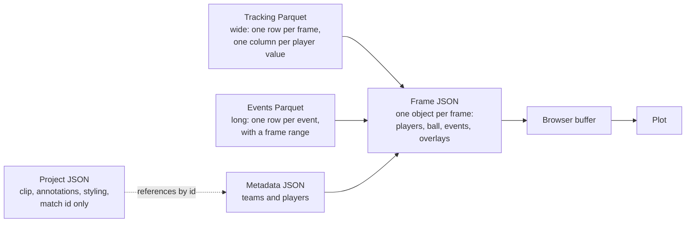

# Data model

This page describes the data at each point it changes shape: the three files
stored per match, the per-frame JSON the server builds from them, and the
project file the browser saves. For how the files are produced, see the
[data pipeline](./data-pipeline.md). For exact request and response shapes,
see the [API reference](../reference/api.md).

## The shapes at a glance



Storage is shaped for compactness (wide, columnar, typed). The wire format is
shaped for drawing (one self-contained object per frame). The server's work
on each frames request is the conversion between the two.

## Conventions that apply everywhere

| Thing | Convention |
|---|---|
| Match id | SkillCorner's integer id, for example `1886347` |
| Frame number | SkillCorner's frame id. 10 per second. Does not start at 0 and has gaps (in the match measured: 10 to 59,038, with 43,458 present). |
| Coordinates | Metres, origin at the centre of the pitch, x along the length |
| Team | The strings `home` and `away`, decided by comparing a player's team id with the home team id in the metadata |
| Missing number | `NaN` in Parquet, `null` in JSON |

## Tracking: `tracking_data_{id}.parquet`

One row per frame. **Wide**: every player contributes five columns, so a
match has roughly 150 to 170 columns.

| Columns | Type | Meaning |
|---|---|---|
| `frame_id` | int64 | Frame number |
| `period_id` | int64 | `1` or `2` |
| `timestamp` | duration | Time since the start of the period |
| `ball_state` | string | `alive` or `dead` |
| `ball_owning_team_id` | float64 | Team in possession, empty when nobody is |
| `ball_x`, `ball_y`, `ball_z` | float32 | Ball position |
| `ball_vx`, `ball_vy`, `ball_speed` | float32 | Derived at build time |
| `home_{player_id}_x`, `_y` | float32 | Player position; empty when the player is not tracked in that frame |
| `home_{player_id}_vx`, `_vy`, `_speed` | float32 | Derived at build time |
| `away_{player_id}_...` | float32 | The same five, for away players |

For match 1886347: 43,458 rows by 156 columns, 151 of them 32-bit floats,
8.5 MB on disk.

**Why wide and not one row per player per frame?** Two reasons. It is the
shape kloppy produces and the shape databallpy's pitch control takes, so
nothing needs reshaping at request time. And one frame is one row, which
makes "give me frames 100 to 400" a simple filter.

**Why `home_` and `away_` prefixes?** That is databallpy's naming convention.
The prefix also lets the server tell teams apart without consulting the
metadata for every value.

**Why 32-bit floats?** Positions in metres to a couple of decimals do not
need 64 bits. Halving the width halves memory during the build and shrinks
the file.

## Events: `events_data_{id}.parquet`

One row per event. **Long**: an event has a start frame and an end frame, and
can span many frames.

- 5,115 rows by 44 columns for match 1886347, 0.4 MB on disk.
- Sorted by `frame_start`. The frame-building code relies on this.
- Four event types: `passing_option` (2,573), `player_possession` (990),
  `on_ball_engagement` (957), `off_ball_run` (595).
- Coordinates already normalised to one attacking direction.

The key columns:

| Column | Meaning |
|---|---|
| `event_id` | Unique id, a string such as `8_0` |
| `phase_index` | Which phase of play the event belongs to. Grouping by this gives phases, and the shot and goal sequences. |
| `frame_start`, `frame_end` | The frames the event covers |
| `event_type`, `event_subtype` | What kind of event |
| `player_id`, `player_name`, `player_position` | Who |
| `team_in_possession_phase_type`, `team_out_of_possession_phase_type` | What each team was doing in that phase |
| `x_start`, `y_start`, `x_end`, `y_end` | Where it started and ended |
| `lead_to_shot`, `lead_to_goal` | Whether the phase ended in a shot or goal |
| `xthreat`, `xpass_completion`, and other `x...` columns | SkillCorner's model outputs |

The full list of 44, grouped, is in the
[API reference](../reference/api.md#event-object).

## Metadata: `meta_data_{id}.json`

SkillCorner's `match.json`, stored unchanged. The parts the app uses:

| Field | Used for |
|---|---|
| `id` | The completeness check: the cache compares it with the id in the file name |
| `home_team`, `away_team` | Names in the header; `home_team.id` decides which players are `home` |
| `home_team_kit`, `away_team_kit` | Default team colours |
| `home_team_score`, `away_team_score`, `date_time` | Match header |
| `players[]` | `id` and `team_id` build the tracking column names; `short_name`, `number` and `player_role` label players |
| `pitch_length`, `pitch_width` | Present, not currently used |

## The frame object

What `/data/frames` returns for each frame number. This is the join of the
three files, assembled per request and never stored.

```json
{
  "period": 1,
  "players": {
    "x": [], "y": [], "player_id": [], "team": [],
    "vx": [], "vy": [], "speed": []
  },
  "ball": { "ball_x": 0.0, "ball_y": 0.0, "ball_z": 0.0 },
  "events": [],
  "overlays": { "pitch_control": { "type": "pitch_control", "data": [[]] } }
}
```

| Part | Comes from |
|---|---|
| `period`, `ball` | The frame's row in the tracking file |
| `players` | The same row, unpivoted: each `home_{id}_x` family becomes one entry across the parallel arrays |
| `events` | Every event row whose frame range covers this frame |
| `overlays.pitch_control` | Computed from the tracking row at request time |

**Parallel arrays, not an array of player objects.** `players.x[i]`,
`players.y[i]` and `players.player_id[i]` all describe the same player.
Plotly takes x and y as arrays, so this shape goes straight into a trace with
no reshaping in the browser, and it avoids repeating key names 22 times per
frame.

**Events are repeated.** An event spanning 40 frames appears in all 40 frame
objects. That is redundant on the wire, and it means the browser never has to
search for what is happening in the current frame.

The matching TypeScript types are in
`frontend/src/types/FrameDataInterfaces.tsx`.

## Key moments

`/data/match_key_moments` returns four lists derived from the event file by
grouping on `phase_index`. They are computed per request and not stored. The
shapes are in the [API reference](../reference/api.md), and the TypeScript
types in `frontend/src/types/KeyMomentsDataInterfaces.tsx`.

## Browser-side structures

These exist only in the browser. They are covered in
[frontend flow](./frontend-flow.md) and
[clips, segments and frames](../concepts/clips-segments-frames.md); listed
here so the whole model is in one place.

| Structure | Shape |
|---|---|
| Frame buffer | A map from frame number to frame object, up to 5,000 entries |
| Clip | `length`, a list of match segments, a list of overlay segments |
| Segment | A range on the clip's timeline mapped to a range of match frames |
| Overlay segment | An overlay kind and a range on the clip's timeline |
| Annotation | A shape with a start frame and an optional end frame |
| Custom timeline | A filter (column, operator, value) or a metric (column, aggregation) over events |

## Project file

A saved session, written by the browser as JSON.

```json
{
  "format": "playtactix-project",
  "schemaVersion": 1,
  "savedAt": "2026-10-03T12:00:00.000Z",
  "match": { "id": 1886347, "source": "skillcorner-github" },
  "clip": { "length": 100, "matchSegments": [], "overlaySegments": [] },
  "selectedEventIds": [],
  "autoDisappearEvents": false,
  "annotations": [],
  "timelines": [],
  "style": {
    "homeTeamColor": "#3B82F6",
    "awayTeamColor": "#EF4444",
    "eventStyles": {},
    "teamVisibility": {},
    "eventVisibility": {}
  }
}
```

Three design points:

- **It references the match; it does not contain it.** Only the match id is
  stored. Opening a project loads the match through the normal flow. This
  keeps the file to a few KB and means it cannot go out of date with respect
  to the data format.
- **It is versioned.** `schemaVersion` is checked on load. There is a table
  of migrations, one per version step, so files saved by older builds can be
  upgraded. It is empty today because there has only been version 1. A file
  from a *newer* version is refused with a clear message.
- **It is validated as untrusted input.** Loading parses the JSON and checks
  every part of the structure before anything is applied, with specific error
  messages for "not JSON", "not a project", "no version", "too new" and
  "incomplete or corrupted".

Code: `frontend/src/types/SavedProject.ts`,
`frontend/src/services/projectSerializer.ts`.

## Trade-offs and limits

- **Wide tracking tables tie the schema to the squad.** Column names contain
  player ids, so every match has a different schema. Code has to discover
  columns by pattern instead of naming them.
- **Frame JSON is verbose.** A chunk of 300 frames is about 1.3 MB before
  pitch control, and events are repeated across frames. A binary format is
  proposed in [frame data caching](../decisions/004-frame-data-caching.md).
- **Stored files carry no version**, unlike the project file. See
  [match cache](../concepts/match-cache.md).
- **Pitch dimensions in the metadata are ignored**; pitch control assumes
  106 by 68.
- **Frame numbers have gaps**, so "frame N plus 300" is not necessarily 300
  real frames, and velocity across a gap is overstated.

## Questions to expect

**Why Parquet?**
The tracking table is wide, numeric and read in bulk. Parquet stores it
column by column with compression and real types, so around 90 MB of raw
input becomes about 9 MB, floats stay floats, and missing values are
represented natively. CSV would be several times larger and would lose the
types.

**Why is tracking wide but events long?**
They are different kinds of data. Tracking is dense: every player has a value
in nearly every frame, so a column per player wastes nothing. Events are
sparse and vary in length, so one row per event with a frame range is the
natural fit.

**Why does the API send parallel arrays?**
The plotting library wants arrays of x and arrays of y. Sending them that way
removes a transform on every frame in the browser and trims the payload.

**Why does the project file not include the match data?**
The data is public, identical for everyone and about 9 MB. Referencing it by
id keeps projects tiny and shareable, at the cost of needing the server to
reopen one.

**How do you handle a project saved by an old version?**
The file records its schema version. On load, migrations are applied one
version at a time up to the current one, then the result is validated. A file
from a future version is rejected, since there is no way to know what it
means.
