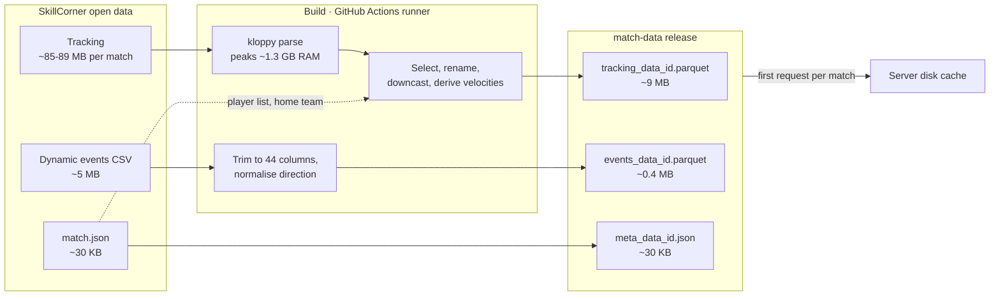

# Data pipeline

This page follows match data from SkillCorner's repository to the files the
server serves. It covers what the build does, where it runs, and how its
output reaches a running server.

Code: `backend/scripts/build_match_data.py`,
`backend/services/data_ingestor_github.py`,
`.github/workflows/build-match-data.yml`.

## The journey



Roughly 90 MB of raw input per match becomes about 9.5 MB of output. The
expensive part is not the size, it is the memory needed while parsing.

## Why this runs somewhere other than the server

Parsing one match's tracking data with kloppy peaks at about 1.3 GB of RAM.
That was most of the backend's memory budget for a single request, and on a
small hosting plan it is more than the whole machine has. The parse is the
same every time for a given match, so there is no reason to repeat it on the
server at all.

The build moves that work to a GitHub Actions runner, which has memory to
spare and costs nothing for a public repository. The server's job shrinks to
copying finished files. The full reasoning and the alternatives are in the
[decision record](../decisions/002-prebuilt-match-data.md).

The separation is enforced, not just intended:

- `kloppy` is only in `requirements-build.txt`, so it is not installed on the
  server.
- `backend/.dockerignore` leaves `scripts/` and `data_ingestor_github.py` out
  of the image, so the server could not run the ingestion if it tried.

## Stage 1: choosing the matches

`build_match_data.py` takes match ids as arguments. With none, it fetches
SkillCorner's `matches.json` index and builds every match in it.

```bash
python backend/scripts/build_match_data.py            # every match
python backend/scripts/build_match_data.py 1886347    # just these ids
```

It then loops over the ids. Two details in that loop matter:

- **One failure does not stop the run.** Each match is wrapped in a
  `try`/`except`; failures are collected, logged at the end, and the script
  exits with status 1 if there were any.
- **Memory is released between matches.** `gc.collect()` runs after each
  one, so the 1.3 GB peak of one match is gone before the next begins.

## Stage 2: building one match

`DataIngestor.load_data(match_id)` does the work. In the code, "bronze" means
data as fetched and "silver" means cleaned and ready to store.

### 2a. Skip if already built

If the output directory already has this match's metadata file, the match is
skipped. On a fresh runner nothing is there, so everything is built. On your
own machine it means a rebuild does nothing until the old files are deleted.

### 2b. Metadata

`match.json` is fetched from SkillCorner's repository and kept exactly as it
is. It supplies the home team id and the player list used in the next steps,
and it becomes `meta_data_{id}.json`.

### 2c. Events

The dynamic events CSV is read straight from GitHub into pandas, then:

1. **Cut down to 44 columns** that the app uses, out of the many SkillCorner
   provides.
2. **Normalised to one attacking direction.** For any event whose
   `attacking_side` is not `left_to_right`, the start and end coordinates are
   negated. After this, nothing downstream needs to ask which way a team was
   attacking.

### 2d. Tracking

This is the heavy step.

1. **Parse with kloppy.** `skillcorner.load_open_data` downloads and parses
   the tracking file, at full sample rate, in SkillCorner's own coordinate
   system, **without empty frames** but including frames where the ball is
   out of play. The result is turned into a DataFrame with one row per frame.
2. **Keep only what is needed.** A handful of base columns (frame id, period,
   timestamp, ball state, owning team, ball position) plus x and y for every
   player listed in the metadata.
3. **Rename player columns.** kloppy names them by player id alone. They are
   renamed to `home_{id}_x` or `away_{id}_x`, the naming databallpy expects
   for pitch control later.
4. **Downcast positions to 32-bit floats.** Positions do not need 64-bit
   precision. Doing this *before* computing velocities halves the memory of
   the table that the next step works on.
5. **Derive velocities.** For the ball and each player: `vx` and `vy` are the
   change in position since the previous row divided by 0.1 seconds, and
   `speed` is their magnitude. All rounded to two decimals, as 32-bit floats.
6. **Attach all derived columns in one go.** They are collected in a
   dictionary and added with a single `concat`. Adding around a hundred
   columns one at a time fragments pandas' internal storage and pushes peak
   memory well above what the finished table needs.
7. **Replace infinities with `NaN`.** Missing values stay as `NaN` all the
   way into the Parquet file, which stores them compactly. Converting them to
   Python `None` would turn the columns into slow, heavy object columns.

Steps 4 and 6 are leftovers from an earlier attempt to make the parse fit on
the server. They did not make it fit, but they still make the build lighter.

### 2e. Write, metadata last

Tracking, then events, then metadata, each written to a temporary file and
renamed. The order and the rename are what let a single file act as the "this
match is complete" marker. See [match cache](../concepts/match-cache.md) and
[atomic writes](../concepts/atomic-writes.md).

## Stage 3: publishing

The **Build match data** workflow wraps the script.

| Step | What it does |
|---|---|
| Trigger | Manual only (`workflow_dispatch`), with an optional list of match ids |
| Set up | Check out the repo, install the Python version pinned in `backend/.python-version`, install `requirements-build.txt` |
| Build | Run the script with the given ids, or all matches if none were given |
| Publish | Create the `match-data` release if it does not exist, upload the Parquet files, then upload the metadata files |

Three details:

- **Publishing runs even if the build step failed** (`if: always()`), so the
  matches that did build are still published when one fails.
- **Uploads overwrite** (`--clobber`). There is one copy of each file, the
  latest.
- **Metadata is uploaded last**, for the same reason it is written last: its
  presence marks the match as complete.

The release is created as not-latest, so it does not show up as the
repository's newest software release.

## Stage 4: reaching a server

Nothing pushes data to servers. Each server pulls a match the first time
someone asks for it, from `MATCH_DATA_BASE_URL` (the release's download URL
by default), and keeps it on disk. That half of the story is in
[backend flow](./backend-flow.md).

## When to run the build

| Situation | Action |
|---|---|
| SkillCorner publishes new matches | Run the workflow for those ids |
| The ingestion code changes what is stored (new column, different type) | Run the workflow for all matches, then clear every server's `data/` |
| Only the server's read code changes | Nothing |

The second row is the one that is easy to get wrong. The release is
overwritten, but servers that already cached the old files keep them, because
the cache has no version.

## Building locally

The script writes into `data/` using the same file names the server looks
for, so a local build also fills a local server's cache, with no release and
no network download involved.

```bash
pip install -r backend/requirements-build.txt
python backend/scripts/build_match_data.py 1886347
```

## Trade-offs and limits

- **Freshness is manual.** Nothing notices when SkillCorner adds a match.
  Someone has to run the workflow.
- **The picker can get ahead of the build.** The frontend lists matches
  straight from SkillCorner, so a match that exists there but was never built
  appears in the picker and fails to load with a `404`.
- **Sources are not pinned.** Metadata and events are read from the tip of
  SkillCorner's `master` branch, so a rebuild could in principle produce
  different output from the same code.
- **Velocities ignore gaps.** Velocity is the difference between consecutive
  *rows* divided by 0.1 seconds. Because empty frames were dropped, two
  consecutive rows can be more than one frame apart, including across
  half-time. The first row after a gap gets a velocity that is too large.
- **No version on the output.** Covered above; the cost is a manual cache
  clear after a format change.
- **The skip check makes local rebuilds a no-op** until the old files are
  removed.

## Questions to expect

**Why prebuild instead of parsing on demand?**
Parsing peaks at about 1.3 GB of RAM per match, the result never changes, and
the finished files are under 10 MB. Doing it once, offline, on a machine with
spare memory, removes the largest resource requirement from the server.

**Why not just get a bigger server?**
It would work, and it would mean paying continuously for memory that is used
for a few seconds per match, once. Prebuilding makes the cost a one-off on a
free runner.

**What did you try first?**
Reducing the parse's memory: 32-bit positions and building the derived
columns in one pass. It helped, and is still in the build, but the peak
could not be brought low enough for a small server.

**What is the medallion naming about?**
Bronze is raw data as fetched, silver is cleaned and shaped for use. The code
uses those labels for the stages. There is no gold layer stored; the nearest
thing is the per-frame JSON the server assembles on request.

**How would you make rebuilds safe?**
Put a schema version in the release tag or the file names. New server code
would then ask for a name the old cache does not have, and pick up the new
files without anyone clearing a disk.

**What happens if the build fails halfway through a match?**
The metadata file is written last, so a half-built match has no marker.
Locally the next run rebuilds it. On the runner its Parquet files may still
be uploaded, but without the metadata file, so a server asking for that match
gets a `404` on the last download and treats it as unavailable.
