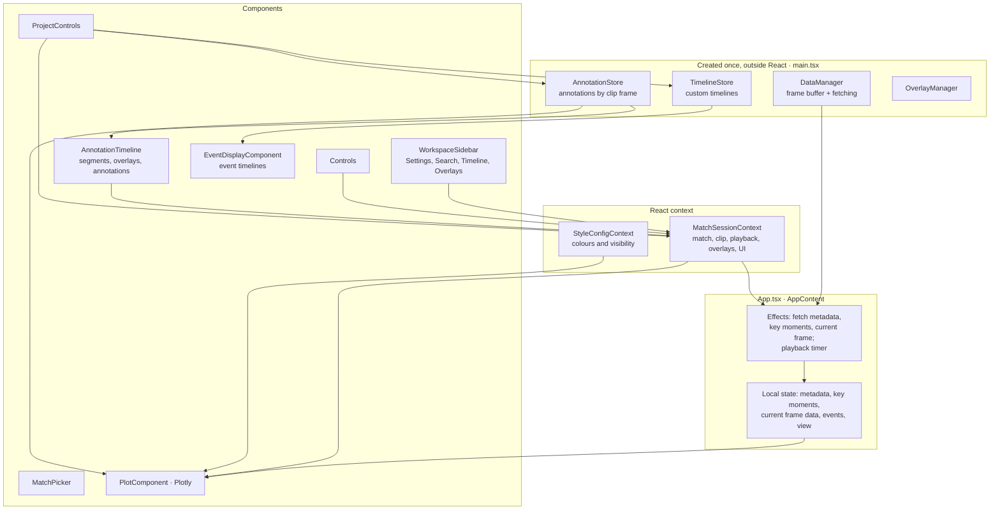
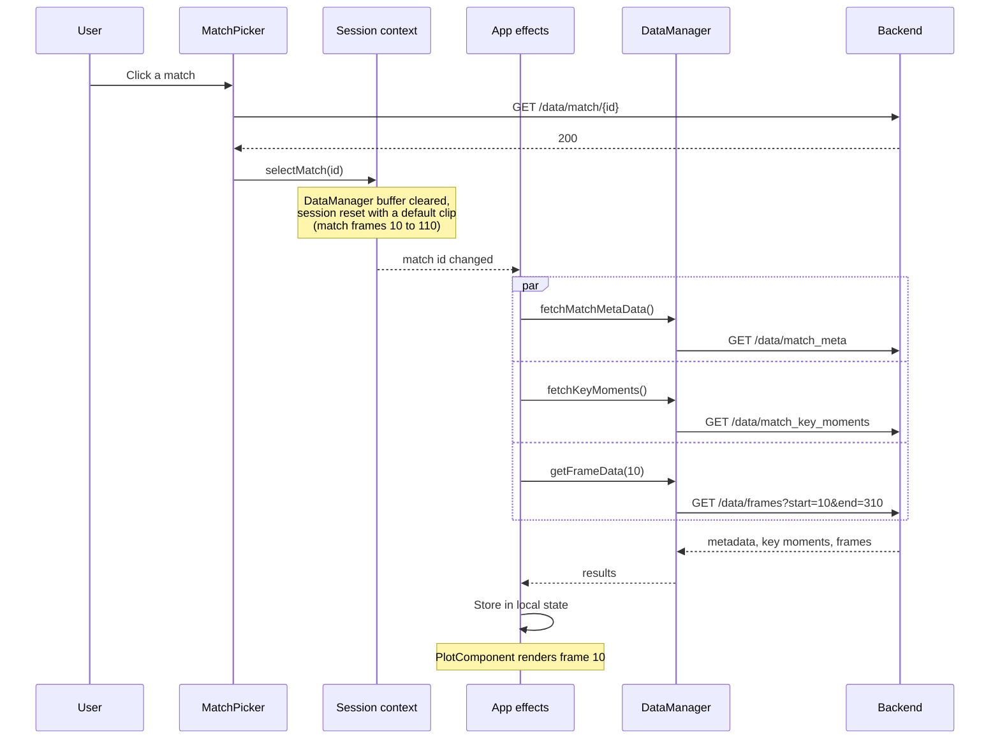
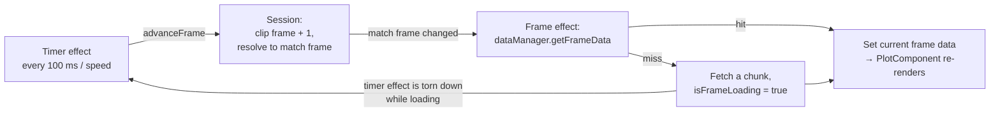

# Frontend flow

This page explains how the browser side is put together: where state lives,
how a frame gets from the network to the pitch, and how a user's action
changes what is drawn. For the server side of the same requests, see
[backend flow](./backend-flow.md).

Code: `frontend/src/`.

## The pieces

| Piece | File | What it holds or does |
|---|---|---|
| `DataManager` | `services/DataManager.ts` | The frame buffer and every call to the backend's read endpoints |
| `MatchDataManager` | `services/MatchDataManager.ts` | The one call that loads a match on the server |
| `AnnotationStore` | `services/AnnotationStore-optimized.ts` | Every annotation, and which are active at a given frame |
| `TimelineStore` | `services/TimelineStore.ts` | The user's custom event timelines |
| `clipManager` | `services/clipManager.ts` | Pure functions that create and edit a clip |
| `MatchSessionContext` | `context/MatchSessionContext.tsx` | The session: selected match, clip, playhead, overlays, sidebar and edit mode |
| `StyleConfigContext` | `context/StyleConfigContext.tsx` | Team colours, event colours, what is visible |
| `App.tsx` | | Wires it together: the fetch effects, the playback timer, the three views |
| `PlotComponent` | `components/PlotComponent.tsx` | Turns one frame plus annotations and overlays into a Plotly figure |

## Three kinds of state

The frontend keeps state in three different ways, and knowing which is which
explains most of the code.

**1. React state in context.** The session (`MatchSessionContext`) is one
object in `useState`, changed only through named actions such as
`selectMatch`, `advanceFrame` or `appendSegment`. Each action builds a new
object, so React re-renders whatever reads it. Clip edits delegate to
`clipManager`, whose functions take a clip and return a new one without
touching the old.

**2. Plain class instances outside React.** `DataManager`, `AnnotationStore`
and `TimelineStore` are created once in `main.tsx` and passed down. They are
mutated in place. React does not notice that on its own, so each has a way to
tell it:

| Store | How React finds out it changed |
|---|---|
| `DataManager` | It does not need to. Callers `await` a frame and put the result in React state. |
| `AnnotationStore` | A version counter in React state is bumped after every edit; components list it as a dependency. |
| `TimelineStore` | A `subscribe` method; components register a listener and store the list in their own state. |

Why not put these in React state too? The frame buffer holds thousands of
objects and changes constantly; copying it on every change would be wasteful,
and nothing renders from the buffer as a whole. They also need to outlive any
one component.

**3. Local component state.** Things only one component cares about: which
sidebar filters are chosen, which players have a focus ring, a player
position being dragged.

## The three views

`AppContent` shows one of three views, held in local state:

| View | Shown when | Contents |
|---|---|---|
| `idle` | On first load | The landing page |
| `picker` | "Choose Game" is clicked | The match list |
| `workspace` | A match is chosen or a project is opened | Match header, sidebar, pitch, timelines |

There is one route, `/app`; `/` redirects to it. The view is not in the URL,
so a reload returns to the landing page.

## From choosing a match to the first frame

The picker waits for the load call before it selects the match. That ordering
is what guarantees the read endpoints never hit the server's `409` gate.

Metadata and key moments each have a status in the session (`idle`,
`loading`, `ready`, `error`), which the header and the save button read.

## The playback loop

Playback is two effects in `App.tsx` feeding each other.

1. **The timer.** While `isPlaying` is true and no frame is loading, an
   interval calls `advanceFrame` every `100 / playbackSpeed` milliseconds.
2. **`advanceFrame`.** Adds one to the clip frame, wrapping to 0 past the end
   of the clip, and translates it to a match frame through the clip's
   segments (see
   [clips, segments and frames](../concepts/clips-segments-frames.md)).
3. **The frame effect.** Runs whenever the match frame changes. It sets
   `isFrameLoading`, asks `DataManager` for the frame, stores the result, and
   clears the flag.
4. **The pause on a miss.** The timer effect depends on `isFrameLoading`, so
   while a chunk is being fetched the interval is removed. Playback stalls
   instead of running ahead of the data.

Scrubbing the slider sets the clip frame directly and stops playback. The
same frame effect then does the fetching.

How the buffer decides hit or miss is covered in
[frame buffering](../concepts/frame-buffering.md).

## Drawing a frame

`PlotComponent` turns the current state into one Plotly figure. Nothing about
the figure is stored; it is derived again on each render.

**Traces, back to front:**

| Layer | Built from |
|---|---|
| Overlays | Pitch control contour, pass probability lines, selected event lines, each only if active at this clip frame |
| Players, four groups | The frame's players, split by what they are doing in this frame's events: not involved, in possession, a passing option, engaging on the ball. Each group gets a different outline colour. |
| Off-ball runs | Dash-dot lines from this frame's off-ball run events |
| Ball | The frame's ball position |

**Layout:**

| Part | Built from |
|---|---|
| Pitch image | Shown when the `pitch` overlay segment covers this clip frame |
| Shapes | Player-link lines (placed from the two players' positions in this frame, with the distance in metres as a label) and hand-drawn shapes, both from `AnnotationStore` for this clip frame |
| Drag mode | Follows the edit mode chosen in the sidebar: draw line, draw rectangle, or select |

Visibility and colours come from `StyleConfigContext`, so toggling a team or
recolouring an event type re-derives the traces without touching the data.

### How a user action flows back

| Action | Path |
|---|---|
| Draw or erase a shape | Plotly emits `relayout` with the new shape list → `AnnotationStore.handleAnnotationRelayout` works out what was added or removed → version counter bumped → shapes re-derived |
| Link two players | Two clicks in "Link Players" mode → `addPlayerLineAnnotation` at the current clip frame |
| Drag a bar on a timeline | `setSegmentRange`, `setOverlaySegmentRange` or `updateAnnotationRange` → clip or store updated → everything re-derived |
| Toggle an overlay | `setActiveOverlaySegment` adds or removes an overlay segment on the clip |
| Click a key moment | `appendSegment` adds it to the end of the clip and moves the playhead there |

### Working around Plotly

Three places where the component reaches past Plotly's public API, each
explained by a comment in the code:

- **Stale lines.** A full redraw clears two of Plotly's three shape layers
  but not the one player lines are drawn in, so a line that should have gone
  can stay on screen. After each update the component removes shape nodes
  whose index no longer exists.
- **Erasing a selected shape.** Plotly has no function for "erase the active
  shape"; the logic lives only in its own toolbar button. The sidebar's Erase
  button therefore clicks that hidden toolbar button.
- **Dragging a player.** Plotly cannot drag a single scatter point. The
  component does its own hit-testing on mouse down and converts pointer
  positions to pitch coordinates using Plotly's axis objects. The moved
  position is temporary and is discarded when the frame changes.

## Saving and opening a project

**Save** gathers the clip and selected events from the session, the
annotations and timelines from their stores, and the styling from the style
context, into one JSON object, and triggers a file download. No request is
made.

**Open** reads the file, validates it, and then:

- if the same match is already open and ready, applies it straight away;
- otherwise loads that match on the server, selects it, and holds the project
  as "pending" until metadata and key moments report `ready`, then applies
  it.

Applying means restoring the clip and selected events into the session and
replacing the contents of the annotation store, the timeline store and the
style context. Selected events are saved as ids and looked up again in the
key moments data, so any that no longer exist are skipped and counted in the
notice shown to the user.

The file format is described in the
[data model](./data-model.md#project-file).

## Trade-offs and limits

- **Every frame is a full redraw.** Each frame hands Plotly new arrays, which
  it redraws from scratch, ten times a second. This is the main cost on the
  browser side.
- **One session object.** Any change to the session, including the playhead
  moving, gives every consumer of the context a new value. With playback at
  10 frames per second that is a lot of re-rendering.
- **Several things only look at the first segment.** `App.tsx` derives the
  segment range, the missing-frame ranges and the event timelines' offset
  from `matchSegments[0]`. With more than one segment those are only right
  for the first.
- **Session state is not persisted.** No local storage, no URL state. A
  reload loses everything not saved to a project file.
- **`OverlayManager` does almost nothing.** It passes the frame through for
  pass probability and has an empty branch for pitch control. It is a
  leftover from when overlays were fetched separately.
- **Two annotation stores exist.** `AnnotationStore.ts` is the older one;
  `AnnotationStore-optimized.ts` is the one in use.
- **The match list bypasses the backend**, so it can show matches the server
  cannot load. See
  [SkillCorner open data](../integrations/skillcorner-open-data.md).

## Questions to expect

**Why is some state in React and some in plain classes?**
What drives rendering directly and changes in small pieces (the session)
lives in React state. Large or frequently mutated collections (the frame
buffer, annotations) live in plain objects that are cheap to mutate, with an
explicit signal to React when something visible changed.

**How does React know the annotation store changed?**
It does not, by itself. After each edit a counter in React state is
incremented, and the memoised shape list has that counter as a dependency.

**Why derive shapes every render instead of storing them?**
Stored copies go stale. Player-link lines depend on where the players are in
this frame, so they have to be recomputed anyway. Deriving from the store and
the frame every time removes a class of "line stuck in the wrong place" bugs.

**What happens if the network is slow during playback?**
The playhead waits. The timer is torn down while a frame is loading, so the
user sees a pause, not skipped or blank frames.

**How would you make playback smoother?**
Fetch ahead of the playhead instead of on a miss, update the Plotly figure
imperatively instead of through React state, and move to a binary frame
format. All three are in the
[frame data caching proposal](../decisions/004-frame-data-caching.md).

**Why Context and not a state library?**
One provider and a handful of actions were enough. The cost is coarse
re-rendering; splitting the context, or moving the playhead out of it, would
be the next step before reaching for a library.
