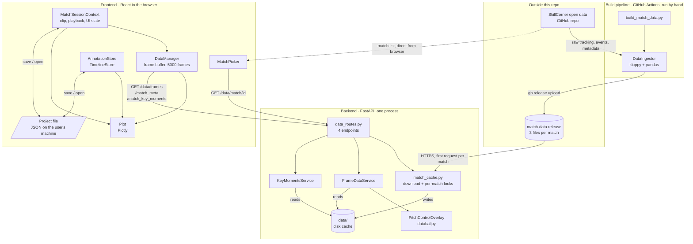
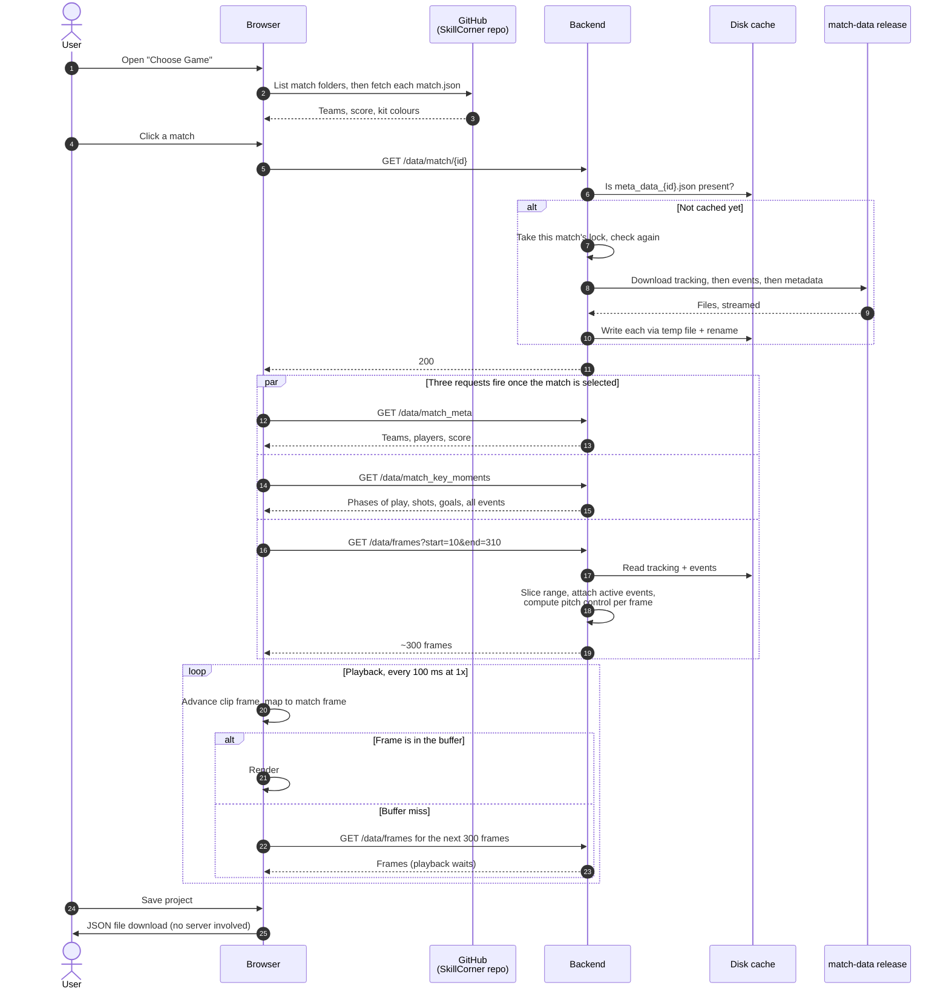

# System overview

This page shows every moving part of Tapp'd on one diagram, walks through what
happens during a session, and records the decisions that gave the system this
shape. The deeper pages for each part are linked as they come up.

## The parts

Code runs in three places: a build pipeline, an API server and the browser.
Two things sit outside the repository: SkillCorner's open-data repo on GitHub,
and the `match-data` release that holds the files the pipeline produces.

| Part | Runs where | Job | Detail |
|---|---|---|---|
| Build pipeline | A GitHub Actions runner, triggered by hand | Parse SkillCorner's raw data and publish three finished files per match | [Data pipeline](./data-pipeline.md) |
| `match-data` release | GitHub | Hold the finished files at stable URLs | [GitHub Actions and releases](../integrations/github-actions-and-releases.md) |
| Backend | One uvicorn process, in Docker | Download a match's files on first request, keep them on disk, serve slices of them | [Backend flow](./backend-flow.md) |
| Frontend | The user's browser | Everything the user sees and everything about their session | [Frontend flow](./frontend-flow.md) |

## What a session looks like

A few things in that flow are worth knowing by heart:

- **Step 5 is a gate.** The three data endpoints refuse with `409` if the
  match's files are not on disk, so the frontend always calls
  `GET /data/match/{id}` first and waits for it.
- **Frames are numbered at 10 per second.** A chunk of 300 frames is 30
  seconds of play, and the browser keeps up to 5000 frames, a little over
  eight minutes.
- **Playback pauses on a miss.** The playback timer does not tick while a
  chunk is being fetched, so a slow request shows up as a stall, never as
  skipped frames.
- **Saving never touches the server.** A project is a file the browser
  writes. It names the match by id; opening it replays steps 5 onwards.

## Where state lives

| State | Lives in | Lifetime | Rebuilt how |
|---|---|---|---|
| Raw tracking and events | SkillCorner's GitHub repo | Permanent, not ours | n/a |
| Prebuilt files (about 9 MB tracking, 0.4 MB events, 30 KB metadata per match) | `match-data` release | Until the workflow is re-run | Re-run the workflow |
| Match cache | Server disk, `data/` (a mounted volume in Docker) | Survives restarts if the volume does; never evicted | Downloaded again on next request |
| Per-match locks | Server process memory | Until the process exits | Created on demand |
| Frame buffer | Browser memory (`DataManager`) | Until the tab closes or the match changes | Fetched again |
| Clip, playback position, selected events, UI state | Browser memory (`MatchSessionContext`) | Until the tab closes | From a project file |
| Annotations, custom timelines | Browser memory (`AnnotationStore`, `TimelineStore`) | Until the tab closes | From a project file |
| Saved work | A JSON file on the user's machine | As long as the user keeps it | n/a |

Nothing in that table is a database, and nothing on the server belongs to a
particular user.

## Decisions behind this shape

Each of these is a choice that could have gone another way. The reasons marked
*inferred* are my reading of the code and commit history; the rest are stated
in the code or the existing design docs. Full records live in
[`decisions/`](../decisions/).

### 1. Parse match data ahead of time, not on the server

Turning SkillCorner's raw tracking into a table goes through kloppy, and that
peaks above 1 GB of RAM for a single match. A small hosting plan cannot do
that inside a request. So the parsing runs on a GitHub Actions runner, and the
server only ever copies finished files of a few MB.

The commit history shows the order this was learned in: first an attempt to
shrink ingestion's memory use (float32 positions, building derived columns in
one concat), then the move to prebuilding.

What it costs: the data is only as fresh as the last workflow run, a match
that was never built returns `404`, and any change to the stored shape needs a
rebuild. Record: `decisions/002-prebuilt-match-data.md`.

### 2. Keep the prebuilt files in a GitHub release

A release gives stable public URLs, costs nothing, lives next to the code, and
can be written from the workflow with the token it already has. The server
needs no credentials to read it. *Inferred.*

What it costs: no versioning of the files (an upload overwrites the previous
one), and the server depends on GitHub being reachable the first time each
match is loaded. Record: `decisions/003-release-as-data-store.md`.

### 3. Download each match lazily, on first request

The alternatives were baking every match into the Docker image, or downloading
them all at startup. Lazy download keeps the image small and startup instant,
and only spends disk on matches somebody opens. *Inferred.*

What it costs: the first person to open a match waits for about 9 MB to
transfer. Everyone after them, and every later restart with the volume
attached, gets it from disk.

### 4. Use the filesystem as the only server-side store

Files are named by match id, and a match counts as cached once its metadata
file exists, because that file is always written last. That one rule replaces
a database table of "which matches are loaded". Two requests for the same
uncached match are serialised by a per-match lock, and each file is written
to a temporary name and renamed, so a reader never sees half a file.

This replaced an earlier design with a single set of fixed-name files, which
could hold only one match at a time for everyone. Record:
[multi-user match caching](../multi-user-match-caching.md). Concepts:
[match cache](../concepts/match-cache.md),
[locks and concurrency](../concepts/locks-and-concurrency.md),
[atomic writes](../concepts/atomic-writes.md).

### 5. Keep all session state in the browser

The server has no idea who is using it. The clip, annotations and playback
position live in the browser, and saved work is a file the user holds. That
removes accounts, authentication and per-user storage from the system
entirely, and means any number of people can use one server without their
sessions touching. *Inferred.*

What it costs: closing the tab loses unsaved work, and sharing means sending
a file to someone who then needs the app.

### 6. Serve frames in chunks and buffer them in the browser

A whole match is 43,000 to 48,000 stored frames (in the two matches checked),
each with 150 to 170 columns, far too much to send at once,
and one request per frame would be too slow for playback at 10 frames per
second. Chunks of 300 are the middle ground. *Inferred.*

What it costs: the buffer is a simple insertion-ordered map with one loaded
range, which gets awkward once a clip has several segments. A proposed
redesign is in [frame data caching](../frame-data-caching.md).

### 7. Compute pitch control on the server and ship it inside each frame

Pitch control arrives as part of every frame in `/data/frames`. An earlier
separate endpoint was removed. One request per chunk therefore brings
everything needed to draw those frames.

What it costs: it is computed for every frame on every request, whether or
not the overlay is switched on, and it is not stored. This is the most
expensive thing the server does at request time.

### 8. Load the match list straight from GitHub in the browser

The picker lists SkillCorner's match folders through the GitHub API and reads
each match's metadata file directly. The backend has no "list matches"
endpoint. *Inferred: simplest thing that worked.*

What it costs: the list is whatever SkillCorner publishes, not what has been
prebuilt, so the two can disagree; and the unauthenticated GitHub API is rate
limited per IP address.

## What is deliberately not here

- **No database.** The data is read-only and addressed by match id, which a
  directory of files already handles.
- **No authentication or user accounts.** Nothing on the server is private or
  per-user.
- **No server-side session.** Every data request carries the match id and is
  answered from disk.
- **No queue or background worker.** The only slow job, parsing, was moved out
  of the server altogether.

## Trade-offs and limits

- **`/data/frames` does the same work repeatedly.** Each request reads the
  whole tracking file from disk, slices it, and computes pitch control for
  every frame in the range. Nothing is kept between requests.
- **Locks are per process.** With more than one worker or more than one
  server instance, two of them could download the same match at once. The
  atomic rename keeps that safe, just wasteful. The Docker image runs a
  single process, so today this does not arise.
- **The cache has no notion of version.** If the build changes the stored
  shape, a server that already cached the old files keeps serving them until
  its `data/` directory is cleared.
- **The cache never evicts.** That is fine while the open-data set is a
  handful of matches at under 10 MB each.
- **The picker and the release can disagree.** A match shown in the picker
  but never built fails at load with a `404`.
- **The log file is truncated on every match load**, so with several users
  one person's load wipes the log of another's.

## Questions to expect

**Why is there no database?**
The data is immutable, keyed by a single id, and read in bulk. Files on disk
give that with nothing to operate. A database would earn its place the moment
there was per-user data on the server, which there is not.

**What happens when two users open the same match at the same moment?**
Both requests see it is not cached. One takes that match's lock and
downloads; the other waits on the lock, re-checks once it gets it, finds the
metadata file present, and returns without downloading.

**And two different matches?**
They hold different locks, so they download in parallel. The route is a plain
`def`, so FastAPI runs it on a threadpool thread and the event loop keeps
serving other requests.

**How do you know a match's files are complete and not half-written?**
Two guards. Each file is written under a temporary name and renamed into
place, which is atomic. And metadata is always written last, so its presence
means the other two are already there.

**What would break first under real load?**
`/data/frames`. It is CPU-bound in pitch control and re-reads Parquet on
every call. The first fixes would be to precompute pitch control in the build
step, or cache it per frame, and to keep the tracking table in memory per
match instead of re-reading it.

**How would you scale to more than one server?**
The design mostly allows it already, because the server holds no user state.
Each instance would build its own disk cache from the release. The only thing
to revisit is the in-process lock, which would need to become a file lock or
simply be accepted as occasional duplicate downloads.

**Why not let the browser download the prebuilt files itself?**
It could fetch them, but slicing Parquet and computing pitch control would
then have to happen in the browser. Keeping that on the server means the
browser only ever handles a few hundred frames of plain JSON at a time.
