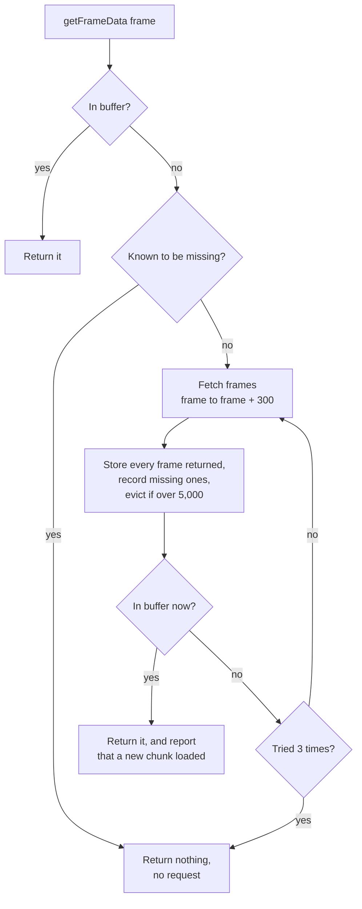

# Frame buffering

A match has tens of thousands of frames and playback shows ten a second. The
browser cannot ask the server for each one as it is needed, and cannot hold
them all. `DataManager` sits in between: it fetches frames in chunks and
keeps a bounded buffer of them.

Code: `frontend/src/services/DataManager.ts`.

## The numbers

| Setting | Value | In time |
|---|---|---|
| Chunk size | 300 frames | 30 seconds of play |
| Buffer limit | 5,000 frames | A little over 8 minutes |
| Retries per chunk | 3 | |
| Playback | 10 frames per second at 1x | |

## What it holds

| Structure | Purpose |
|---|---|
| `buffer`: map of frame number → frame | The frames themselves |
| `missingFrames`: set of frame numbers | Frames the server has said do not exist |
| `selectedMatchId` | Which match the buffer belongs to |

Switching match clears both collections. Frames from two matches are never
mixed.

## Getting a frame

`getFrameData(frame)` is called every time the playhead moves.

Three outcomes:

- **Hit.** The frame is in the buffer. Returned immediately. During smooth
  playback this is 299 calls out of every 300.
- **Miss.** One request fetches this frame and the 300 after it. The caller
  is told a new chunk arrived, and uses that to refresh the scrubber's
  "loaded" band and the event timelines.
- **Known missing.** The server previously listed this frame number as
  absent. No request is made.

## Why track missing frames

Frame numbers have gaps. The server returns a placeholder for each absent
number and lists it in `missing_frames`.

Without the set, a missing frame would look exactly like one that has not
been fetched yet, and every time the playhead reached it the browser would
fetch the same chunk again. Recording them turns that into a single lookup.

`getMissingFrameRanges` merges the set into contiguous ranges, which the
scrubber draws as grey bands so gaps in the data are visible.

## Eviction

After each chunk is stored, if the buffer holds more than 5,000 frames, the
oldest entries are removed until it is back under the limit.

"Oldest" means first inserted. A JavaScript `Map` remembers insertion order,
so the first key it yields is the earliest added. This is first-in-first-out,
not least-recently-used: a frame that was fetched early and has been
replayed a hundred times goes before one fetched a moment ago and never
shown.

## What the user sees

The scrubber's track is painted in four bands:

| Band | Meaning |
|---|---|
| Played | Behind the playhead |
| Loaded | In the most recently loaded chunk, ahead of the playhead |
| Not loaded | Beyond it |
| Missing | Confirmed absent from the data |

When the playhead reaches the end of the loaded band there is a miss, a
request, and a pause until it returns. At 1x speed that is one pause every 30
seconds of play; at 8x, every few seconds.

## Trade-offs and limits

- **No fetching ahead.** A chunk is requested only when the playhead reaches
  a frame that is not there. Fetching the next chunk while the current one
  plays would remove the pause altogether.
- **Chunks are not aligned.** A chunk starts at whatever frame missed, so
  scrubbing around produces overlapping requests for mostly the same frames,
  and no two requests share a URL that a browser cache could reuse.
- **First-in-first-out eviction suits one direction only.** It works for
  playing forward through a match. For a looping clip longer than the buffer,
  it evicts the start of the clip just before the loop returns to it, so
  every lap re-fetches everything.
- **One "loaded range".** The session records only the most recent chunk's
  range, so the scrubber's loaded band is wrong once more than one chunk, or
  more than one segment, is in the buffer.
- **Nothing survives a reload.** The buffer is in memory only.
- **Payloads are large JSON.** Each frame carries a pitch control grid and
  repeats its events.
- **A failed chunk is retried immediately**, three times, with no delay
  between attempts.

All of these are analysed, with a proposed redesign, in
[frame data caching](../decisions/004-frame-data-caching.md): block-aligned chunks, a
store pinned to the clip's footage, least-recently-used eviction, fetching
ahead at segment boundaries, and a binary wire format.

## Questions to expect

**Why chunks of 300?**
It is a balance. Smaller chunks mean more requests and more pauses; larger
ones mean a longer wait on each miss and more wasted work when the user jumps
elsewhere. 300 frames is 30 seconds, enough to cover most single passages of
play in one request.

**Why cap the buffer?**
Each frame is several KB of parsed objects, more with pitch control. A whole
match would be a very large amount of memory in the tab. The cap bounds it.

**What is wrong with first-in-first-out here?**
It ignores how the data is used. The frames most likely to be needed again
are the ones in the clip being built, and those are often the oldest in the
buffer. Pinning the clip's frames and evicting the least recently used of the
rest would fit the usage.

**How would you remove the pause?**
Start fetching the next chunk when the playhead is, say, 100 frames from the
end of what is loaded, and at a segment boundary fetch the start of the next
segment. The clip tells you exactly which frames will be needed, so there is
no guessing.

**Could the browser's own cache do this?**
Partly. Frame data for a given match and range never changes, so with
aligned chunk URLs and an `immutable` cache header the browser would serve
repeats without a request, including after a reload. It would not help with
the in-memory decoded objects, which still need a buffer.
