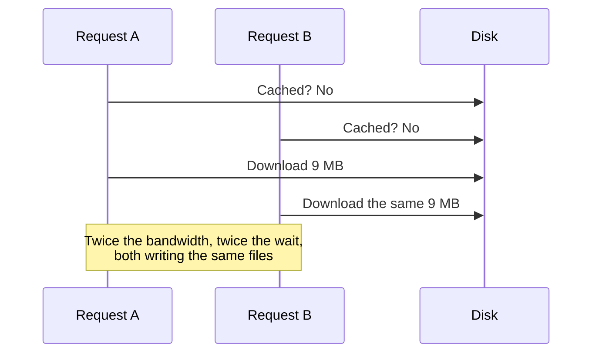
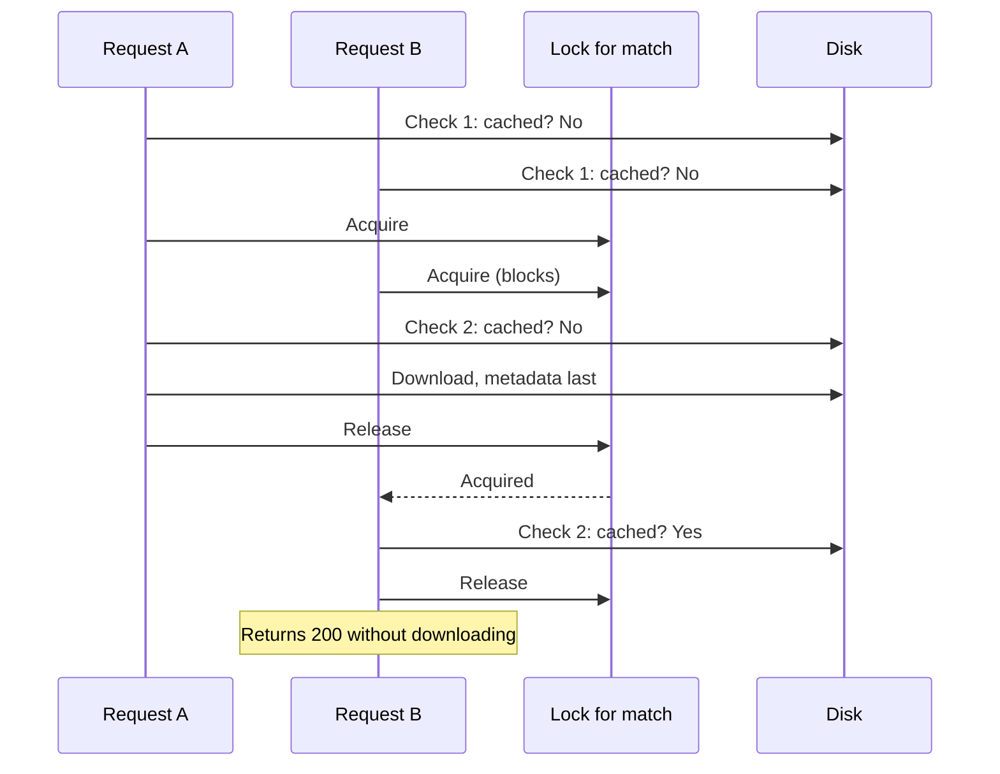

# Locks and concurrency

The backend has exactly one place where two requests can get in each other's
way: filling the [match cache](./match-cache.md). This page explains the
problem, the lock that solves it, and how the server's threading model fits
around it.

Code: `backend/services/match_cache.py`, `backend/routes/data_routes.py`.

## The problem

Two people open the same match at the same moment, and it is not cached yet.
Without any coordination:



Thanks to [atomic writes](./atomic-writes.md) this would not corrupt
anything, but it wastes time and bandwidth, and it gets worse with every
extra simultaneous user.

This is a "check then act" race: the check (is it cached?) and the action
(download it) are separate steps, and another request can slip in between.

## The solution: one lock per match

```python
_match_locks: dict[int, threading.Lock] = {}
_match_locks_guard = threading.Lock()

def _lock_for_match(match_id):
    with _match_locks_guard:
        lock = _match_locks.get(match_id)
        if lock is None:
            lock = threading.Lock()
            _match_locks[match_id] = lock
        return lock
```

There are two kinds of lock here, doing different jobs.

**The per-match lock** is held for the whole download of one match. Only one
request at a time can be downloading match `1886347`. A request for a
different match uses a different lock and is not held up at all.

**The guard lock** protects the dictionary of locks itself. Looking up or
creating a lock is also "check then act": two requests could both see that no
lock exists for a match and each create their own, and then they would be
holding different locks and the protection would be gone. The guard makes
"find or create" a single step. It is held only for that dictionary lookup,
a few microseconds, never during a download.

### Why not one global lock?

A single lock around all downloads would be simpler and would also be
correct. But it would make someone opening match A wait for someone else's
download of match B, for no reason: the two downloads touch different files.
A lock per match id gives exactly as much exclusion as the files need.

## Double-checked locking

```python
def ensure_match_cached(match_id):
    if is_match_cached(match_id):          # check 1, no lock
        return

    with _lock_for_match(match_id):
        if is_match_cached(match_id):      # check 2, holding the lock
            return
        ... download three files ...
```

The match is checked twice, and each check has a purpose.

**Check 1, without the lock,** is the fast path. Once a match is cached,
which is the case for almost every call, the request returns without taking
any lock. If this check were skipped, every load of an already-cached match
would queue behind every other.

**Check 2, holding the lock,** is what makes it correct. Between check 1 and
getting the lock, another request may have completed the download. Without
the second check, the waiting request would download everything again the
moment it got the lock.



The pattern is safe here because the thing being checked is on disk and
becomes true through an atomic rename. There is no moment when the marker
file is half there.

## Where the threads come from

Locks only matter if requests really run at the same time. They do, because
of how the load route is declared:

```python
@router.get("/match/{match_id}")
def download_match_data(match_id: int):     # plain def
```

FastAPI treats the two kinds of route function differently:

| Declaration | Where it runs | Effect of blocking work |
|---|---|---|
| `async def` | On the event loop, the single thread that juggles all connections | Stops the whole server until it finishes |
| `def` | On a thread from a worker pool | Only that thread waits; the event loop keeps serving |

A download with `requests` is blocking: the thread sits waiting on the
network. Declared as plain `def`, each load runs on its own pool thread, so
several loads can be in flight together, which is why a
`threading.Lock` is the right kind of lock. Declared as `async def`, the
whole server would freeze for the length of each download.

The download also has timeouts (10 seconds to connect, 60 seconds between
bytes), so a stalled transfer raises an error and gives its thread and its
lock back. Without them, a hung connection would hold the match's lock
forever and every later request for that match would wait behind it.

## What readers do

The read endpoints take no lock. They do not need one:

- they only run after the gate has seen the completeness marker;
- cached files are never edited, only replaced whole;
- nothing they do writes to disk.

Many readers of the same match run without any coordination.

## What the locks do not cover

- **More than one process.** A `threading.Lock` lives in one process's
  memory. Run two uvicorn workers, or two containers, and each has its own
  set of locks. Two processes can then download the same match at once. With
  separate disks that is only duplicated work. With a shared disk there is a
  real hazard: both write to the same temporary file name, described in
  [atomic writes](./atomic-writes.md). The Docker image starts a single
  process, so this does not happen today. When scaling out, the answer is a
  file lock, or a unique temporary name per writer.
- **The read routes.** These are `async def` and do blocking work (reading
  Parquet, computing pitch control), which holds the event loop. That is a
  throughput problem, not a correctness one, and it is separate from the
  locking. See [backend flow](../architecture/backend-flow.md).
- **Growth of the lock dictionary.** A lock is created per match id ever
  requested and never removed. With around 20 matches that is around 20 small objects.
  A request for an id that does not exist also creates one.

## Trade-offs and limits

- **A failed download makes waiters retry in turn.** If request A fails,
  request B gets the lock, finds the match still not cached, and tries the
  download itself. That is the right behaviour for a transient failure and
  slow for a permanent one: each waiter runs into the same error in sequence.
- **Waiters block a pool thread each.** A burst of requests for one uncached
  match parks that many threads until the download finishes. The pool is
  finite (40 threads by default), so a large enough burst could delay other
  plain-`def` work.
- **No fairness or timeout on the lock itself.** A waiter waits as long as
  the holder takes, bounded in practice by the download timeouts.

## Questions to expect

**What is a race condition, in this code?**
Two requests both see "not cached" and both start downloading. The check and
the action are separate steps, and the outcome depends on timing.

**Why two checks?**
The first avoids taking a lock in the common case where the match is already
cached. The second, under the lock, catches the case where another request
finished the work while this one was waiting.

**Why a lock per match and not one lock?**
Different matches write different files, so they have no reason to wait for
each other. A per-match lock excludes exactly the requests that conflict.

**Why does the dictionary of locks need its own lock?**
Creating a lock on first use is itself a check-then-act. Two threads could
each create a lock for the same match and then not exclude each other. The
guard makes find-or-create atomic.

**Could this deadlock?**
No. A thread holds the guard only while touching the dictionary and never
while waiting for a match lock, and it only ever holds one match lock. There
is no pair of locks taken in opposite orders.

**Why `threading.Lock` and not `asyncio.Lock`?**
The route is a plain function running on pool threads, so the contention is
between threads. An asyncio lock coordinates coroutines on one event loop and
would not protect anything here.

**What changes with multiple workers?**
The lock stops being shared. You would use a lock that lives outside the
process, such as a file lock on the cache directory. Duplicate downloads
are tolerable only once each writer uses its own temporary file name.
