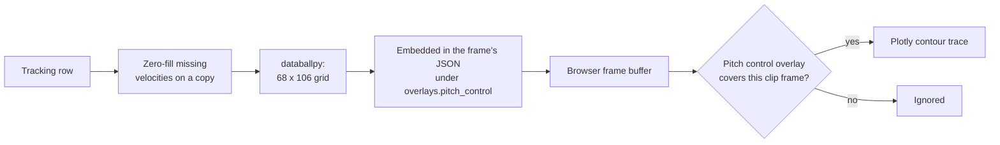

# Pitch control

Pitch control is the overlay that colours the pitch by which team controls
each area. This page explains what the model means, how it gets from the
tracking data to the screen, and what it costs.

Code: `backend/services/pitch_control_overlay.py`,
`backend/services/frame_data_service.py`,
`frontend/src/plot/overlays/pitchControlOverlay.ts`.

## What it is

For any point on the pitch, ask: if the ball arrived here now, which team
would get to it first? A pitch control model answers that for every point at
once, using where each player is and how fast and in which direction they are
moving. A player sprinting towards a space controls more of it than one
standing the same distance away, or one running the other way.

The result is a surface over the whole pitch. Areas clearly belonging to one
team take that team's colour; contested areas are in between.

It is useful for exactly the things video hides: the space a full-back has
left behind, the pocket a midfielder is about to receive in, how a press
closes an area down.

## How it is computed

Tapp'd does not implement the model. It calls databallpy's
`get_pitch_control_single_frame`.

```python
class PitchControlOverlay:
    def get_pitch_control(self, frame_row, pitch_dimensions=(106, 68)):
        pitch_control = get_pitch_control_single_frame(
            frame_row, pitch_dimensions, pitch_dimensions[0], pitch_dimensions[1])
        return pitch_control.tolist()
```

| Input | Detail |
|---|---|
| One row of the tracking table | Positions and velocities for every player, in columns named `home_{id}_x`, `home_{id}_vx` and so on. This naming is why the build step renames the columns. |
| Pitch dimensions | 106 by 68 metres, fixed |
| Grid size | 106 by 68 cells, about one per square metre |

The output is a grid of 68 rows by 106 columns, 7,208 numbers, converted to
nested lists for JSON.

### The missing-velocity problem

Velocity is derived from the previous frame, so a player's first frame on the
pitch (kick-off, a substitution, coming back into camera view) has a position
but no velocity. The model cannot take a missing value.

Before the call, `_fill_missing_velocities` copies the row and, for every
player who has a position but lacks a velocity, sets the velocity to zero.
"Standing still" is the neutral assumption. The stored data is untouched.

If the computation still fails for a frame, the error is logged, that frame
goes out without an overlay, and the rest of the chunk is unaffected.

## How it reaches the screen



1. **Server.** While building each frame for `/data/frames`, the server
   computes the grid and puts it in the frame under
   `overlays.pitch_control.data`.
2. **Browser.** The grid sits in the frame buffer with the rest of the frame.
3. **Drawing.** If the clip has a `pitch_control` overlay segment covering
   the current clip frame, `buildPitchControlOverlay` turns the grid into a
   Plotly contour trace, positioned from -53 to 53 metres in x and -34 to 34
   in y, at 40% opacity so players stay visible.

The colour scale runs from the home team's colour at one end to the away
team's at the other, through a blend of the two in the middle. Because it
uses the current team colours, recolouring a team in Settings recolours the
overlay.

Switching the overlay on or off, or changing the range it covers on the
timeline, is entirely in the browser. No request is made, because the grid is
already there.

## Why it is embedded in the frame

There used to be a separate `/data/pitch_control_overlay` endpoint. It was
removed: it was broken and nothing called it. The working path was always the
one that embeds the grid in each frame.

The advantage of embedding is that one request brings everything needed to
draw a chunk, and the overlay can be toggled instantly. The disadvantage is
the cost below.

## What it costs

- **Computed for every frame, on every request.** The server works out 300
  grids for each chunk, whether or not the user has the overlay on.
- **Never stored.** The same frame requested twice is computed twice.
- **It dominates the payload.** A frame's players and ball are roughly 150
  numbers; its pitch control grid is 7,208.
- **It blocks the server.** The frames route is `async def` and the
  computation is synchronous, so while one chunk is being computed the server
  handles nothing else.

The real time and size per chunk have not been measured in these docs; see
the note in [backend flow](../architecture/backend-flow.md).

## Trade-offs and limits

- **The pitch size is assumed.** Every match is treated as 106 by 68. The
  metadata has the true size (104 by 68 for the match measured) and it is not
  passed through, so the surface is slightly stretched relative to the
  players.
- **Zero velocity is a guess.** A player entering at a sprint is treated as
  stationary for one frame.
- **Velocities after a gap are overstated**, because they are computed across
  consecutive rows that may be more than one frame apart. Pitch control in
  the first frame after a gap inherits that.
- **Resolution is fixed** at about one metre.

## Where it could go

| Option | Gain | Cost |
|---|---|---|
| Compute only when asked (a query flag, or a separate endpoint that works) | No work when the overlay is off | A request when it is switched on |
| Precompute in the build step and store alongside tracking | Server does no model work at all | Much larger files: 7,208 numbers for each of ~45,000 frames |
| Lower resolution, for example 53 by 34 | A quarter of the numbers | A coarser surface |
| Send as packed 32-bit floats instead of JSON | Far smaller and faster to parse | A binary format on both sides |
| Cache computed grids per match and frame on the server | Repeats are free | Memory, and a cache to manage |

## Questions to expect

**What does pitch control tell you?**
Which team would win the ball at each point on the pitch, given positions and
movement. It makes space visible: who owns it, and how that changes from
frame to frame.

**Did you implement the model?**
No. It is databallpy's implementation. The work here was getting the data
into the shape it needs, handling the cases it cannot (missing velocities),
and getting the result to the browser.

**Why compute it on the server and not in the browser?**
The model is a Python library working on a pandas row. Doing it server-side
meant no reimplementation in TypeScript. The price is payload size.

**Why is it slow, and what would you do?**
It is computed for every frame of every chunk regardless of whether it is
shown. The first fix is to compute it only on request. After that,
precomputing at build time at a lower resolution and sending it in a binary
format.

**What is the bug with pitch dimensions?**
The call hard-codes 106 by 68, and the frontend positions the surface on the
same assumption, while real pitches vary. The metadata carries the true size
and should be passed to both.
