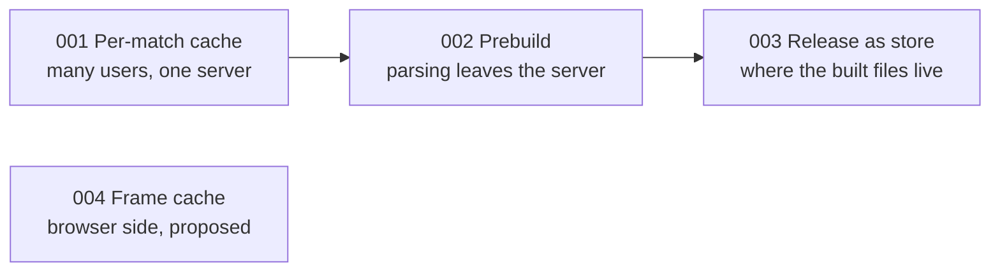

# Decisions

One record per decision that shaped the system: what the situation was, what
was chosen, what else was considered, and what it cost. Read these when the
question is "why is it like this?" The
[system overview](../architecture/system-overview.md) has a one-paragraph
summary of each.

## Index

| # | Decision | Status | Date |
|---|---|---|---|
| 001 | [Cache matches per id, shared by all users](./001-per-match-cache.md) | Implemented | 2026-09-26 |
| 002 | [Prebuild match data instead of parsing on the server](./002-prebuilt-match-data.md) | Implemented | 2026-10-03 |
| 003 | [Keep prebuilt data in a GitHub release](./003-release-as-data-store.md) | Implemented | 2026-10-03 |
| 004 | [Tiered frame cache in the browser](./004-frame-data-caching.md) | Proposed, not built | 2026-08-29 |

Records 001 and 004 were written before this folder existed, as
`docs/multi-user-match-caching.md` and `docs/frame-data-caching.md`, and were
moved here unchanged. Two code comments (`backend/paths.py`,
`backend/services/match_cache.py`) still refer to the old path of 001.

## How they connect

001 made the server safe for more than one user by giving each match its own
files, a lock and atomic writes. Deploying that showed the next problem:
parsing a match needed more memory than a small host has. 002 moved the
parsing off the server, and 003 answered where its output should live. The
cache, lock and atomic-write machinery from 001 carried over unchanged; it
now guards a download where it used to guard a parse.

004 is independent of the others. It concerns how the browser holds frames.

## Smaller decisions without their own record

These are explained where they apply.

| Decision | Where |
|---|---|
| A separate "load match" endpoint, and `409` for reads before it | [Backend flow](../architecture/backend-flow.md) |
| Metadata written last, as a completeness marker | [Match cache](../concepts/match-cache.md) |
| A lock per match, checked twice | [Locks and concurrency](../concepts/locks-and-concurrency.md) |
| Session state in the browser, projects as files | [System overview](../architecture/system-overview.md) |
| Wide Parquet for tracking, parallel arrays on the wire | [Data model](../architecture/data-model.md) |
| Annotations timed in clip frames | [Clips, segments and frames](../concepts/clips-segments-frames.md) |
| Pitch control embedded in each frame | [Pitch control](../concepts/pitch-control.md) |

## Format of a record

Each record has the same sections, so they can be skimmed:

1. **Status and date**
2. **Context**: the situation and the constraint that forced a choice
3. **Decision**: what was chosen, in a sentence or two
4. **How it works**: just enough to follow the consequences
5. **Consequences**: what got better and what got worse
6. **Alternatives considered**: and why each lost
7. **Revisit when**: the conditions that would change the answer
