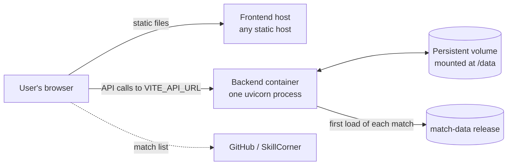

# Docker and deployment

How the backend is packaged, what a host needs to provide, and how the two
halves of the app find each other once deployed.

Code: `backend/Dockerfile`, `backend/.dockerignore`.

> **To fill in (Mihir):** where this is actually deployed, if anywhere. The
> code comments mention Render, Railway and Vercel as examples, but nothing
> in the repository says which is in use. The host's memory limit is also the
> missing fact behind [decision 002](../decisions/002-prebuilt-match-data.md).

## The shape of a deployment



Two deployables:

| Part | What it is | Needs |
|---|---|---|
| Frontend | Static files from `npm run build` | Any static host. `VITE_API_URL` set **at build time**. |
| Backend | A Docker container | A persistent disk at `/data`, outbound HTTPS to GitHub, `ALLOWED_ORIGINS` set |

There is no database, queue or cache service to provision.

## The image

```dockerfile
FROM python:3.13-slim
WORKDIR /app
COPY requirements.txt .
RUN pip install --no-cache-dir -r requirements.txt
COPY . .
RUN useradd --create-home --shell /usr/sbin/nologin appuser \
    && mkdir -p /data /logs \
    && chown -R appuser:appuser /app /data /logs
USER appuser
ENV PORT=8000
EXPOSE 8000
CMD ["sh", "-c", "uvicorn main:app --host 0.0.0.0 --port ${PORT}"]
```

Line by line:

| Step | Why |
|---|---|
| `python:3.13-slim` | Matches the pinned Python version, without the full image's build tools |
| Copy `requirements.txt` and install before copying the code | Docker caches layers. Dependencies change rarely and code changes often, so this order means a code change does not reinstall everything. |
| `--no-cache-dir` | Keeps pip's download cache out of the image |
| Create `appuser`, own `/app`, `/data`, `/logs` | The process does not run as root. It can write only where it needs to. |
| `ENV PORT=8000` with `${PORT}` in the command | Hosts that inject their own `PORT` override it; the shell form is needed so the variable is expanded at start |
| `--host 0.0.0.0` | Listen on all interfaces, so the container is reachable from outside itself |
| One uvicorn process, no `--workers` | The per-match locks are in process memory and assume a single process |

### Why `/data` and `/logs`

`paths.py` and `logger.py` find their directories as "two levels above this
file". In the repository that is the repo root, giving `data/` and `logs/`
next to `backend/`. In the image, the contents of `backend/` are copied
straight into `/app`, so two levels above `/app/paths.py` is `/`. Hence
`/data` and `/logs`.

### What is left out of the image

`backend/.dockerignore` excludes:

| Excluded | Why |
|---|---|
| `venv/`, `__pycache__/`, `.pytest_cache/` | Local artefacts |
| `.env` | Configuration comes from the host's environment, not a file in the image |
| `notebooks/`, `tests/`, `requirements-dev.txt` | Not needed to serve |
| `scripts/`, `services/data_ingestor_github.py`, `requirements-build.txt` | The build-time parser. Keeping it out guarantees the server cannot run the 1.3 GB ingestion. |

## Running it

```bash
cd backend
docker build -t playtactix-backend .
docker run -p 8000:8000 -v playtactix-data:/data playtactix-backend
```

With configuration:

```bash
docker run -p 8000:8000 \
  -v playtactix-data:/data \
  -e ALLOWED_ORIGINS=https://your-frontend.example \
  playtactix-backend
```

## The volume

The match cache is the only state the server has, and it lives at `/data`.

| Without a volume | With a volume |
|---|---|
| Every restart or redeploy starts with an empty cache | The cache survives restarts |
| The first user of each match after every restart waits for a download | Only the very first load of each match ever downloads |
| Works, just slower | Preferred |

Losing the volume loses nothing permanent. Everything in it can be downloaded
again.

Size it for the whole data set: about 170 MB for 20 matches, so 1 GB is
ample.

Logs go to `/logs/playtactix.log` inside the container and to standard
output. Hosts collect standard output, so `/logs` does not need a volume.
Note that the file is truncated on every match load.

## Connecting frontend and backend

Two settings must agree, and each lives on the opposite side:

| Setting | Set on | Value |
|---|---|---|
| `VITE_API_URL` | The frontend, at **build** time | The backend's public URL |
| `ALLOWED_ORIGINS` | The backend, at run time | The frontend's public origin |

The browser enforces CORS: a page served from one origin may only call an API
on another if the API says that origin is allowed. If `ALLOWED_ORIGINS` does
not list the frontend's exact origin (scheme, host and port), every API call
fails in the browser, even though the same URL works from `curl`.

`VITE_API_URL` is baked into the JavaScript when the frontend is built. It
cannot be changed on a running deployment; the frontend must be rebuilt.

## Health checks

`GET /`, `GET /hello` and `GET /data/hello` return a small JSON body without
touching the disk. Any of them can be used as a host's health check. They
confirm the process is up, not that the cache or the release is reachable.

## Scaling

| Direction | Effect |
|---|---|
| More memory or CPU on one instance | Helps directly. Pitch control is CPU-bound. |
| More uvicorn workers in one container | Works, with duplicate downloads possible on a cold match, since each worker has its own locks. They share the disk, so the cache is shared. |
| More containers | Works. Each has its own cache unless they share a volume. Duplicate downloads possible. |

A duplicate download is normally harmless, because files are renamed into
place only when complete. There is one caveat: two processes downloading the
same file share a temporary file name, which is described in
[atomic writes](../concepts/atomic-writes.md). Fix that before running more
than one process against a shared disk. See also
[locks and concurrency](../concepts/locks-and-concurrency.md).

## Limits

- **No HTTPS in the container.** The host is expected to terminate TLS.
- **No health check that tests dependencies.**
- **CORS allows all methods and headers with credentials** for the listed
  origins. The API only has `GET` endpoints and no authentication, so this is
  looser than it needs to be but exposes nothing.
- **Unused dependencies in the image.** `mplsoccer` and `plotly` are
  installed but not imported by the server.
- **No frontend Dockerfile.** The frontend is deployed as static files.

## Questions to expect

**Why Docker?**
One artefact that runs the same locally and on any host, with the Python
version and dependencies fixed. It also made the build/serve split
enforceable: the image physically lacks the ingestion code.

**Why is the dependency install a separate layer?**
Layer caching. Docker reuses a layer if its inputs are unchanged, so copying
only `requirements.txt` first means the slow install is skipped on every
build where only code changed.

**Why run as a non-root user?**
If the process is compromised, it has only the permissions of that user:
write access to the data and log directories and nothing else in the
container.

**What state does the container have, and what happens when it is lost?**
Only the match cache. Losing it costs a re-download per match. That is what
makes the service easy to redeploy and to scale.

**Why does the frontend need rebuilding to point at a different backend?**
Vite substitutes `VITE_` variables into the bundle at build time. There is no
server to read an environment variable at run time; the frontend is static
files.
