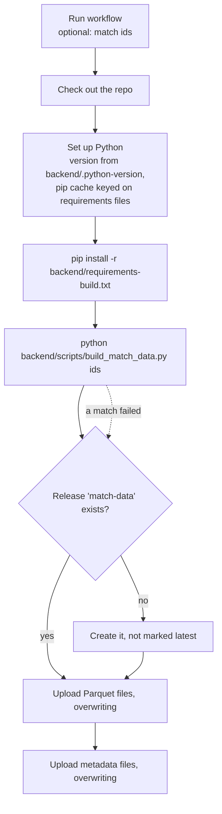

# GitHub Actions and releases

GitHub does two jobs for Tapp'd beyond hosting the code: an Actions workflow
builds the match data, and a release stores it. This page is the operational
view. The reasoning is in decisions
[002](../decisions/002-prebuilt-match-data.md) and
[003](../decisions/003-release-as-data-store.md).

Code: `.github/workflows/build-match-data.yml`.

## The workflow

**Name:** Build match data.
**Trigger:** by hand only (`workflow_dispatch`).
**Runs on:** `ubuntu-latest`, a GitHub-hosted runner.



### Running it

From the repository's **Actions** tab: choose **Build match data**, then
**Run workflow**. Leave the ids box empty to build everything, or enter ids
separated by spaces.

From the command line:

```bash
gh workflow run build-match-data.yml                         # every match
gh workflow run build-match-data.yml -f match_ids="1886347"  # just these
```

### Details that matter

| Detail | Why |
|---|---|
| `permissions: contents: write` | Creating a release and uploading assets needs write access to repository contents. Nothing broader is granted. |
| `GH_TOKEN: ${{ github.token }}` | The `gh` command uses the token GitHub issues to each run. No stored secret. |
| `if: always()` on the publish step | If one match fails to build, the ones that succeeded are still published. The run is still marked failed. |
| `--clobber` | An upload replaces an existing asset of the same name. Re-running is safe. |
| Parquet first, metadata second | The metadata file marks a match as complete, here as everywhere else. |
| `--latest=false` on creation | Keeps the data release from being shown as the project's latest version. |
| Python version from `backend/.python-version` | The build uses the same Python as development. |
| The match ids go through an environment variable | The input is not interpolated straight into the shell command. |

### When to run it

- SkillCorner has published matches that are not in the release.
- The ingestion code changed what is stored. Then also clear the `data/`
  directory on every server, since their caches have no version.

It does not run on push, on a schedule, or on pull requests.

## The release

**Tag:** `match-data`.
**Contents:** for each built match, `tracking_data_{id}.parquet`,
`events_data_{id}.parquet` and `meta_data_{id}.json`.

Each asset has a stable public URL:

```
https://github.com/MihirT906/PlayTactix/releases/download/match-data/tracking_data_1886347.parquet
```

The server's `MATCH_DATA_BASE_URL` is everything up to the last slash. A
request for a file that is not there returns `404`, which the server turns
into "no prebuilt data for this match".

The release is used purely as a file store. Its tag does not point at a
meaningful version of the code, and its assets are replaced in place.

## A quirk in `.gitignore`

The repository's `.gitignore` ignores `.github/*` and then un-ignores
`.github/workflows/`. The workflow file had to be let through explicitly when
this was added; other files under `.github/` remain ignored.

## Checking that it worked

1. The run in the Actions tab is green, or red with the failed match ids in
   the last lines of the build step's log.
2. The release page lists three assets for each match.
3. `curl -I` on a metadata URL returns a redirect to the download.
4. On a server with an empty cache, `GET /data/match/{id}` returns `200`.

## Limits

- **Manual.** Nothing notices new matches or a changed format.
- **All-or-nothing memory per match.** Each match needs about 1.3 GB while
  parsing. The runner has enough; matches are built one after another with
  memory released between them.
- **No history of the data.** Assets are overwritten, so there is no way to
  fetch last week's build.
- **One build at a time is assumed.** Two runs overlapping would both upload
  to the same assets; whichever finishes last wins.
- **No checksums or manifest.** The server trusts that a `200` is a good
  file.

## Questions to expect

**Why a manual trigger?**
The inputs change rarely: when SkillCorner adds matches or when the ingestion
code changes. A build takes real time and bandwidth, so running it on every
push would be wasteful. A sensible next step would be to trigger it
automatically when the ingestion file changes.

**How are credentials handled?**
There are none to manage. The workflow writes with the short-lived token
GitHub provides for the run, scoped to repository contents. The server reads
public URLs with no authentication.

**What happens if the build fails for one match?**
The script carries on with the rest and exits non-zero at the end. The
publish step runs regardless, so every match that did build is uploaded, and
the run shows as failed so the problem is visible.

**How would you add validation?**
Have the build write a manifest with each file's size and hash plus a schema
version, upload it last, and have the server check a downloaded file against
it before renaming it into the cache.
