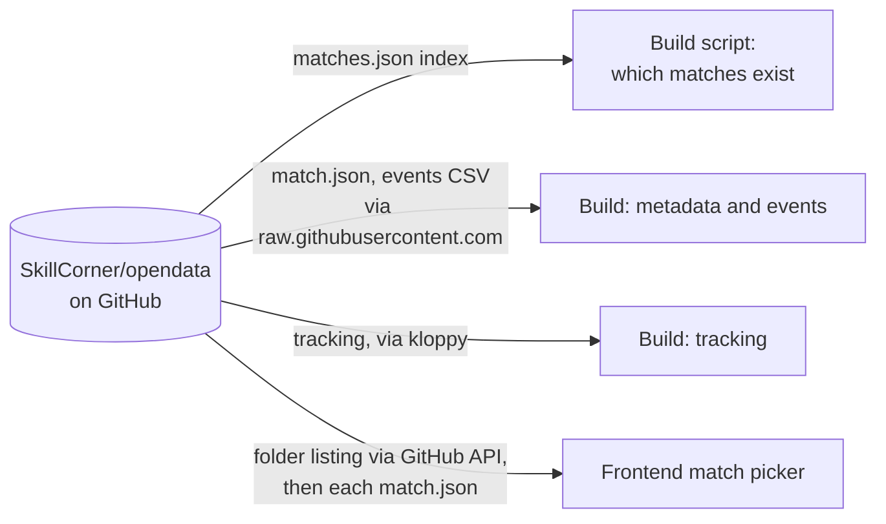

# SkillCorner open data

All match data in Tapp'd comes from
[SkillCorner's open data repository](https://github.com/SkillCorner/opendata)
on GitHub. This page covers what is taken from it, the three places the
project touches it, and the risks that come with depending on it.

## What it is

SkillCorner derives tracking data from broadcast video. Their open data
repository publishes a set of matches from the Australian A-League with, for
each match:

| File | Contents | Size |
|---|---|---|
| `{id}_match.json` | Teams, kits, players, score, pitch size, periods | about 30 KB |
| Tracking data | Player and ball positions, 10 frames per second | about 85 to 89 MB |
| `{id}_dynamic_events.csv` | Possessions, passing options, engagements, off-ball runs, with model outputs such as expected threat | about 5 MB |

There were 20 matches when counted in September 2026. The repository also has
a `matches.json` index listing them.

The data is subject to SkillCorner's terms of use.

## Where the project touches it

### 1. The build, for the data itself

`backend/services/data_ingestor_github.py` reads three things per match:

| What | How |
|---|---|
| Metadata | An HTTP GET of `{id}_match.json` from `raw.githubusercontent.com`, on the `master` branch |
| Events | `pandas.read_csv` straight from the URL of `{id}_dynamic_events.csv`, on `master` |
| Tracking | kloppy's `skillcorner.load_open_data`, which knows where the tracking file is and parses it. See [kloppy](./kloppy.md). |

### 2. The build script, for the list of matches

With no ids given, `build_match_data.py` fetches `matches.json` and builds
every match in it.

### 3. The frontend, for the match picker

`frontend/src/components/MatchPicker.tsx` goes to GitHub directly from the
browser, without involving the backend:

1. One call to the GitHub API to list the folders under `data/matches`.
2. One request per folder to `raw.githubusercontent.com` for that match's
   `match.json`.

The cards in the picker (team names, score, kit colours) are built from those
files. Only when a card is clicked does the backend get involved.

**The running server never contacts SkillCorner.** It reads only the
prebuilt files from this repository's release.

## What is used from it

| From | Used for |
|---|---|
| Player and ball positions | Everything drawn on the pitch; velocities and pitch control are derived from them |
| `match.json` players and teams | Naming tracking columns, labelling players, team colours, match header |
| Event types and frame ranges | Highlighting players, off-ball run lines, the event overlay, event timelines |
| `phase_index` and phase types | Phases of play in the key moments finder |
| `lead_to_shot`, `lead_to_goal` | Finding the sequences that mattered |
| `xpass_completion` | The pass probability overlay |
| `xthreat`, `xloss`, `xshot` columns | Metric timelines |

44 of the event columns are kept; the rest are dropped at build time.

## Risks and limits

- **The picker and the server can disagree.** The picker lists what
  SkillCorner publishes; the server can only load what has been built. A new
  match appears in the picker immediately and fails with a `404` until the
  build workflow is run for it.
- **The picker depends on the GitHub API's anonymous rate limit**, which is
  per IP address. Opening the picker costs one API call plus one file request
  per match. Heavy use from one network could exhaust it, and the picker
  would then be empty.
- **The picker makes one request per match.** With 20 matches that is 21
  requests each time it opens, and the result is not kept between visits.
- **Nothing is pinned to a version.** Metadata and events are read from the
  tip of `master`. Metadata used to be pinned to a specific commit; that was
  changed so that newly added matches could be found. If SkillCorner edits a
  file, a rebuild will produce different output.
- **The competition name is hard-coded.** The picker's heading says
  "Australian A-League" regardless of what the data contains.
- **The format is theirs.** A change to column names in the events CSV would
  break the build at the column-selection step.

## What would make this more robust

- **Serve the match list from the backend**, built from what is actually in
  the release. The picker and the server could then never disagree, the
  browser would make one request, and there would be no GitHub rate limit in
  the user's path.
- **Pin the source to a commit** in the build, and move the pin deliberately.
- **Publish a manifest** from the build workflow listing the matches built
  and the versions used.

## Questions to expect

**Where does the data come from, and are you allowed to use it?**
SkillCorner's open data repository, published for public use under their
terms. The project uses it as published, credits it in the UI and the README,
and redistributes only derived files.

**Why does the frontend call GitHub directly?**
It was the simplest way to get a match list before the backend had any notion
of "available matches". It is now the main inconsistency in the system, since
the server's set of loadable matches is defined by the release, not by
SkillCorner.

**What happens if SkillCorner's repository goes away?**
Matches already built stay available from the release and from server caches.
No new matches could be built, and the picker would stop working, because it
is the one runtime dependency on SkillCorner.

**How would you support another data provider?**
kloppy already normalises several providers' tracking formats into one model,
so the tracking side would mostly be a different loader call. Events are
provider-specific, so the event transform and everything built on SkillCorner
columns, such as phases and expected-threat metrics, would need an equivalent
per provider.
