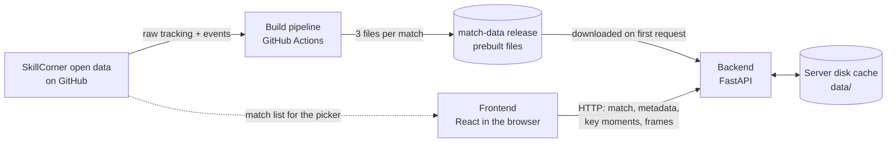

# Overview

## What Tapp'd is

Tapp'd is a telestrator for football tracking data. A TV analyst pauses match
footage and draws on it to explain what happened; Tapp'd does the same thing
on top of tracking and event data instead of video. When you spot something in a match, find the moment, add analytial overlays on it, and annotate on it to create a presentation-ready clip that can be shared with others. 

## The problem it solves

Tracking data records where every player and the ball are, ten times a second,
for a whole match. That is enough to explain almost any tactical question, but
in its raw form it is a table with hundreds of columns and tens of thousands
of rows. But nobody watches football in rows and columns. They watch moments, shapes and runs. Tapp'd turns those rows back into moments you can replay, question and learn from.

## Current Features

| Capability | Description |
|---|---|
| Find moments in football terms | Load open matches and search for moments, by filtering whether a move ended in a shot or goal, or by event type, area of the pitch and player position, instead of hunting through 90 minutes. |
| See what video can't show | Add tactical overlays like Pitch control or pass probability to make space and passing options visible, so you can show the technicals behind a play. |
| Draw on the play as it moves | Draw annotations in time with the action, so the explanation plays out alongside the move. |
| Tell the story in one clip | Stitch moments from across the match into a single clip, to create a clip that you can come back to or share with others. |

The detail of each of these lives in the [user guide](./user-guide/).

## The shape of the system

There are three places where code runs:

1. **The build pipeline** turns SkillCorner's raw data into three compact files
   per match and publishes them. This is the expensive step, and it happens
   ahead of time, away from the server.
2. **The backend** downloads those finished files the first time a match is
   asked for, keeps them on disk, and serves slices of them over HTTP.
3. **The frontend** holds everything about the user's session: the clip being
   built, the annotations, the playback position, and a buffer of recently
   fetched frames.

There is no database, no login and no server-side session. The server's only
state is the files on its disk. The full picture is in the
[system overview](./architecture/system-overview.md).

## Tech stack

The "why" column is what the code implies, not a record of what was decided at
the time. Rows marked *inferred* need your confirmation or correction.

| Layer | Technology | Why |
|---|---|---|
| Frontend framework | React 19, TypeScript, Vite | Component model suits a workspace made of panels; TypeScript keeps the frame and clip shapes honest across the app. *Inferred.* |
| Pitch rendering | Plotly.js | Gives scatter traces, heatmaps and drawable, editable shapes out of the box, which covers players, pitch control and annotations with one library. *Inferred.* |
| API | FastAPI on uvicorn | Small surface (four data endpoints), a threadpool for the one blocking route, and dependency injection for the "is this match loaded" gate. *Inferred.* |
| Data handling | pandas, pyarrow (Parquet) | Tracking data is wide and columnar; Parquet stores it in a few MB per match and keeps float nulls natively. |
| Pitch control | databallpy | Provides a single-frame pitch control model, so it did not have to be written from scratch. *Inferred.* |
| Ingestion (build only) | kloppy | Parses SkillCorner's tracking format into a DataFrame. It is the reason for prebuilding: parsing one match peaks above 1GB of RAM. |
| Build and hosting of data | GitHub Actions, GitHub Releases | A free runner with enough memory does the parsing; a release is a free, public file host. |
| Packaging | Docker | One image for the backend, with the cache on a mounted volume. |
